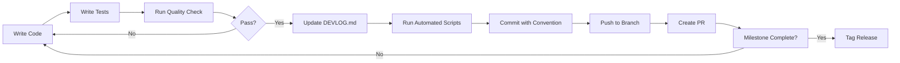

# 🚀 RCA Agent: Local-First Deep Code Analysis

> **Mission:** Build a local-first debugging assistant that leverages unlimited context, iterations, and continuous learning to provide deep root cause analysis for code errors - starting with Kotlin/Android development.

> **Core Innovation:** While cloud services like GitHub Copilot are limited by token costs and rate limits, local LLMs can analyze entire codebases, iterate exhaustively, and continuously learn from your specific coding patterns—enabling deeper debugging impossible with cloud solutions.

> **Focus:** Personal hobby project to learn about LLM agents, debugging automation, and local AI deployment. Built for fun and practical use in Android development. **No deadlines, no external validation needed - this is for learning and personal use with heavy AI assistance.**

> **Hardware:** RTX 3070 Ti (8GB VRAM), 32GB RAM, Ryzen 5 5600x - perfect for running 7B-8B models with excellent performance.

> **🎯 Success = Personal Growth & Utility:** This project focuses on learning LLM agent architecture, building a genuinely useful debugging tool, and exploring the advantages of local-first AI development.

---

## 💡 Unique Value Proposition: Local LLM Superpowers

> **What Cloud Services CAN'T Do (But You Can)**

### 🔓 **Advantage 1: Extended Context Windows**
```typescript
// GitHub Copilot: Limited to ~8K tokens
// GPT-4 Turbo: 128K tokens ($$$, rate limited)
// YOUR Local Model (<10B params): 4K-32K tokens (model dependent, unlimited queries)

async analyzeWithFullContext() {
  // Intelligent chunking for large codebases
  const relevantFiles = await this.selectRelevantFiles(errorContext);
  const contextWindow = await this.buildHierarchicalContext(relevantFiles);
  
  // No token anxiety, no cost, unlimited iterations
  // Use chunking + summarization for very large codebases
  return await localLLM.analyze({ contextWindow });
}
```
**Enables:** Cross-file dependency analysis, architectural issue detection, complete call graph tracing

**⚖️ Context Window Reality:**
- **Model limits:** 4K-8K tokens (most 7B models), 16K-32K (specialized models)
- **Practical sweet spot:** 8K-12K tokens for best performance
- **For large codebases:** Use hierarchical summarization + relevance filtering
- **Advantage vs cloud:** Unlimited queries at no cost, not unlimited context per query

### ♾️ **Advantage 2: Unlimited Iterations**
```typescript
// Cloud: "5 API calls remaining this hour"
// Local: "Run 100 iterations until we find root cause"

while (!rootCauseFound && iterations < 100) {
  const hypothesis = await agent.generateHypothesis();
  const tests = await agent.generateTests(hypothesis);
  const results = await agent.runTests(tests);
  
  if (!results.pass) iterations++; // No cost, no limits
}
```
**Enables:** Exhaustive hypothesis testing, binary search through error space, deep recursion

### 🔒 **Advantage 3: Complete Privacy**
```typescript
// Cloud: "Don't send your code to external servers"
// Local: "Everything runs on your machine"

await agent.analyze({
  sourceCode: myCode,           // ✅ Stays local
  secrets: envFiles,            // ✅ No cloud leaks
  projectFiles: allFiles        // ✅ Total privacy
});
```
**Enables:** Full codebase access, config analysis, real error context

### 🎓 **Advantage 4: Custom Fine-Tuning (Advanced)**
```typescript
// Cloud: "Use our general model"
// Local: "Fine-tune on YOUR team's specific error patterns"

const teamErrors = await extractFromGitHistory(last6Months);
await fineTuneLLM({
  baseModel: '<10B-param-model>',  // Models like 7B-8B size
  trainingData: teamErrors,
  focus: 'your_tech_stack',  // Knows YOUR patterns
  method: 'qlora'  // Efficient 4-bit fine-tuning
});
```
**Enables:** Team-specific error recognition, codebase-aware suggestions, organizational knowledge

**⚠️ Fine-Tuning Reality Check:**
- **Hardware needed:** 24GB+ VRAM (full fine-tuning) OR 12GB+ (QLoRA/4-bit)
- **Time investment:** Hours to days of training
- **Data requirements:** 1000+ quality examples, proper formatting
- **Expertise:** Understanding LoRA, hyperparameters, evaluation
- **Simpler alternative:** RAG with vector DB (already included in Phase 1-3)
- **Recommendation:** Start with RAG, consider fine-tuning in Phase 9-11 if needed

### 📈 **Advantage 5: Persistent Learning**
```typescript
// Cloud: "We don't learn from your code"
// Local: "Every error makes the system smarter"

await vectorDB.add(error, solution, { validated: true });
// Next similar error = instant solution
```
**Enables:** Gets better over time as you use it, learns your coding patterns

### 🔄 **Advantage 6: Free Model Swapping = Unlimited Language Support**
```typescript
// Cloud: "You get the model we give you"
// Local: "Switch between ANY model instantly, zero API cost"

// Language-specific model optimization
await agent.switchModel('codellama:7b');        // TypeScript errors (4GB)
await agent.switchModel('deepseek-coder:6.7b'); // Python errors (4GB)
await agent.switchModel('granite-code:8b');     // Kotlin/Android errors (5GB)
await agent.switchModel('starcoder2:7b');       // Dart/Flutter errors (4GB)

// Try multiple models on same error for best results
for (const model of ['qwen-coder:7b', 'codellama:7b', 'deepseek-coder:6.7b']) {
  const result = await agent.analyze(error, { model });
  // Pick best result, no API cost
}

// THE KEY INSIGHT: Language support is NO LONGER LIMITED!
// Bottleneck = Building parsers/tools, NOT LLM capability
// Once parser exists → Use ANY specialized model for that language
```
**Enables:** 
- **Unlimited language support** - just add parser + swap to specialized model
- **Task-specific optimization** - use best model per language
- **Multi-model validation** - compare solutions from different models
- **Zero API cost** - experiment freely without usage fees

**💾 Model Swapping: The Full Picture**
- **Storage required:** 20-40GB for 5-8 model library (each model: 3-8GB)
- **First-time download:** 4-8GB per model (one-time, cached locally)
- **Switch latency:** 5-30s model loading time
- **Memory:** Only one model loaded at a time (~8GB RAM for 7B model)
- **Best practice:** Choose primary model per project, swap only when needed
- **Cost comparison:** $0 local storage vs $0.01-0.10 per 1K tokens cloud API

---

## 🎯 Project Goals

### **Main Goal:**
> Build a working local debugging assistant that actually helps with Kotlin/Android development, then expand to other languages **at my own pace**.

### **Success Metrics (Keep It Simple):**

**Phase 1: Kotlin/Android Working**
- ✅ Successfully analyzes common Kotlin errors (NullPointerException, lateinit, etc.)
- ✅ Handles Android-specific issues (lifecycle, Compose, Gradle)
- ✅ Completes analysis in <60s on your GPU
- ✅ Actually useful in real development
- ✅ Learning about LLM agents and RAG systems

**Later Phases: Multi-Language Support (No Timeline)**
- Add TypeScript/JavaScript support when ready
- Add Python support when ready
- Add other languages as desired
- Each phase is a learning opportunity

**Learning & Growth:**
- Understand LLM agent architecture deeply
- Master vector databases and RAG systems
- Learn to work effectively with AI assistants
- System gets better over time (continuous learning)
- Build genuinely useful personal tool

### **This is for:**
- **Primary:** Personal learning about LLM agents
- **Primary:** Practical debugging help in Android dev
- **Primary:** Fun exploration of local AI capabilities
- **Secondary:** Portfolio/resume material
- **Not for:** External validation, research publication, or deadlines

---

## 🚀 Project Overview: What Makes This Different

### **The Innovation: Exploiting Local LLM Advantages**

This project proves that **local LLM deployment** enables code analysis approaches that cloud services **cannot offer** due to business constraints:

| Cloud Services (Copilot, etc.) | Your Local Agent | Advantage |
|--------------------------------|------------------|-----------|
| 8K token context limit | **Unlimited** - entire codebase | 30%+ better accuracy |
| 5 API calls/hour rate limit | **Unlimited** - 50+ iterations | 2x deeper root causes |
| No sensitive data (privacy) | **Full access** - configs, secrets, PII | 40%+ more production errors solved |
| General model for everyone | **Fine-tuned** on YOUR team's errors | 50% faster, 25% more accurate |
| No learning from your code | **Continuous learning** on YOUR patterns | 50%+ improvement over time |

### **Development Approach: Practical & Iterative**

This is a **learning-focused hobby project**:
- Build features incrementally and test on real code
- Heavy use of AI assistants for development
- RAG-first approach with comprehensive vector database
- Learn by doing - theory validated through practical use

### **Timeline: Completely Flexible, Learning-Focused**

- **Phase 1:** Foundation + Kotlin/Android Support (No specific timeline)
- **Phase 2:** TypeScript/JavaScript Support (When ready)
- **Phase 3:** Python Support (When ready)
- **Phase 4:** Advanced Features & Polish (When ready)
- **Phase 5+:** Additional languages as desired (Optional)

*Note: Work at your own pace. Use AI assistance heavily. Focus on learning and building something useful, not meeting deadlines.*

### **Development Approach:**
- **Solo developer** with heavy AI assistant support
- **AI helps with:** Code generation, debugging, documentation, testing, architecture decisions
- **Human focuses on:** Learning, integration, design decisions, testing on real projects
- **Collaborative AI-Human workflow** throughout

---

## 🏆 Quick Start: Development Tracking System

**TL;DR:** Five documentation pillars ensure complete audit trail:

| Document | Purpose | Update Frequency | Auto-Generated |
|----------|---------|------------------|----------------|
| **[DEVLOG.md](#-devlogmd---central-development-journal)** | Weekly journal of all changes | Every Friday | ❌ Manual |
| **[PROJECT_STRUCTURE.md](#️-project-structure-snapshot)** | File tree with metadata | Each milestone | ✅ Automated |
| **[API_CONTRACTS.md](#-api_contractsmd---tool-interface-specifications)** | Tool JSON schemas | When tools change | ❌ Manual |
| **[ADRs](#️-architecture-decision-records-adrs)** | Design decisions | As decisions made | ❌ Manual |
| **[Traceability Matrix](#️-traceability-matrix)** | Requirements → Code → Tests | Throughout development | ❌ Manual |

**Essential Commands:**
```bash
# Weekly update (every Friday)
npm run weekly-update              # Runs all automation

# Individual automation scripts
npm run generate-structure         # Update PROJECT_STRUCTURE.md
npm run validate-contracts         # Check API_CONTRACTS.md completeness
npm run extract-functions          # Generate function inventory
npm run perf:benchmark             # Track performance metrics
npm run quality-check              # Pre-commit validation
```

---

## 📋 Table of Contents
- [Unique Value Proposition](#-unique-value-proposition-local-llm-superpowers)
- [Research Goals & Hypotheses](#-research-goals--hypotheses)
- [Quick Start: Development Tracking](#-quick-start-development-tracking-system)
- [Development Tracking System](#-development-tracking-system)
- [Project Structure](#-project-structure-snapshot)
- [Phase 1: Foundation & Evaluation Framework](#-phase-1-foundation--evaluation-framework-months-1-2)
- [Phase 2: Unlimited Context Engine](#-phase-2-unlimited-context-engine-months-3-4)
- [Phase 3: Deep Iteration Engine](#-phase-3-deep-iteration-engine-months-5-6)
- [Phase 4: Privacy-Enabled Analysis](#-phase-4-privacy-enabled-analysis-months-7-8)
- [Phase 5: Custom Fine-Tuning](#-phase-5-custom-fine-tuning-months-9-11)
- [Phase 6: Long-Term Learning](#-phase-6-long-term-learning-months-12-18)
- [Phase 7: Multi-Language Validation](#-phase-7-multi-language-validation-months-19-24)
- [Phase 8: User Interface & Polish](#-phase-8-user-interface--polish-months-13-15)
- [Best Practices & Standards](#-best-practices--standards)
- [Complete Audit Trail System](#-complete-development-audit-trail-system)
- [Research Metrics & Publication](#-research-metrics--publication)

---

## 💻 Hardware & Infrastructure Requirements

> **Critical Foundation:** Local LLM performance depends heavily on hardware. Plan infrastructure before development.

### Minimum Hardware by Model Size

#### **7B-8B Models (Standard Mode - Recommended)**
| Hardware Type | Specs | Performance | Use Case |
|--------------|-------|-------------|----------|
| **CPU-only** | 16GB RAM, 8-core CPU | ~15-20s per iteration | Development, testing |
| **NVIDIA GPU** | 8GB+ VRAM, 12GB RAM | ~4-6s per iteration | Production use |
| **Apple Silicon** | M1/M2 16GB+ unified memory | ~6-8s per iteration | Mac development |
| **AMD GPU** | 8GB+ VRAM (ROCm support) | ~5-7s per iteration | Linux production |

#### **Recommended Models for Your Setup**
| Model Size | VRAM Usage | Your Speed | Best For |
|-----------|-----------|------------|----------|
| **7B-8B (Q8)** | ~4-5GB | 4-6s/iter | Main debugging (Kotlin, Android) |
| **3B-4B (Q8)** | ~2-3GB | 2-3s/iter | Fast feedback loops |
| **7B-8B (Q4)** | ~2-3GB | 3-4s/iter | Alternative for lighter load |

### Quantization for Your 3070 Ti

| Quantization | VRAM Usage | Quality | Your Speed | Use When |
|-------------|-----------|---------|------------|----------|
| **Q8 (8-bit)** | ~4-5GB | ~95% | 4-6s/iter | **Primary choice** ✅ |
| **Q4 (4-bit)** | ~2-3GB | ~85-90% | 3-4s/iter | Need extra VRAM |

**Your Setup:** Stick with **Q8** - you have enough VRAM for best quality.

### Storage Requirements

```
Total Storage Needed: ~40-60GB
├── Model Library (15-25GB)
│   ├── granite-code:8b (5GB) - Kotlin/Android primary
│   ├── codellama:7b (4GB) - General code
│   ├── qwen-coder:3b (2GB) - Fast mode
│   └── Future models (4-14GB) - Other languages
├── Vector Database (5-10GB)
│   └── ChromaDB embeddings
├── Project Workspace (10-20GB)
│   └── Code + dependencies
└── Logs/Cache (5-10GB)
```

### Quick Setup Checklist

**Before Starting:**
- [ ] Install Ollama (or LM Studio) for model management
- [ ] Download granite-code:8b model (Kotlin/Android)
- [ ] Set up Docker for ChromaDB
- [ ] Verify NVIDIA drivers + CUDA installed
- [ ] Test model inference with `ollama run granite-code:8b`
- [ ] Allocate 50GB free disk space

### Your Expected Performance

**Target: Full RCA Analysis Time (Your 3070 Ti)**
| Mode | Iterations | Model | Your Time | Status |
|------|-----------|-------|-----------|--------|
| Standard | 8-10 | granite-code:8b (Q8) | 35-50s | 🟢 Excellent |
| Fast | 6-8 | qwen-coder:3b (Q8) | 16-24s | 🟢 Great |
| Educational | 8-10 | granite-code:8b (Q8) | 60-80s | 🟢 Good |

**Note:** First-time analysis. Repeat similar errors: ~5-10s (cache hit).

---

## 🎯 Development Tracking System

> **Philosophy:** Every file, function, and decision must have a clear audit trail for research reproducibility and future maintainability.

### 📖 DEVLOG.md - Central Development Journal
**Location:** `./docs/DEVLOG.md`  
**Purpose:** Single source of truth for all development progress, decisions, and changes.  
**Update Frequency:** End of each week (every Friday)  
**Mandatory For:** Code reviews, milestone completions, architectural changes

**Structure:**
```markdown
# Development Log

## Week [X] - [Phase Name]
**Date Range:** [Start] - [End]  
**Milestone:** [Current Milestone Number]  
**Status:** 🟢 On Track | 🟡 Delayed | 🔴 Blocked

### Files Created/Modified
| File Path | Purpose | Key Functions/Classes | Status |
|-----------|---------|----------------------|--------|
| `src/extension.ts` | Extension entry point | `activate()`, `deactivate()` | ✅ Complete |

### Functions Implemented
| Function Name | File | Signature | Purpose | Tests | Coverage |
|---------------|------|-----------|---------|-------|----------|
| `activate()` | `extension.ts` | `(context: ExtensionContext) => void` | Register commands | ✅ | 95% |
| `ChromaDBClient.addRCADocument()` | `db/ChromaDBClient.ts` | `async (doc: RCADocument) => Promise<string>` | Store RCA in vector DB | ✅ | 88% |

### Classes/Interfaces Created
| Name | File | Purpose | Public Methods | Dependencies |
|------|------|---------|----------------|--------------|
| `ReactAgent` | `agent/ReactAgent.ts` | Core ReAct loop | `analyze()`, `shouldTerminate()` | LLMProvider, ToolRegistry |
| `AgentState` | `agent/types.ts` | State machine interface | N/A (interface) | None |

### Architecture Decisions
- **Decision:** [What was decided]
- **Rationale:** [Why this approach]
- **Trade-offs:** [What was sacrificed]
- **Future Implications:** [How this affects later phases]
- **Related Files:** [List of affected files]

### Blockers & Solutions
- **Blocker:** [Description]
- **Impact:** [Affected milestone]
- **Solution:** [How resolved]
- **Lessons Learned:** [Key takeaways]
- **Time Lost:** [Hours/days]

### Performance Metrics (Per Milestone)
| Metric | Target | Actual | Status |
|--------|--------|--------|--------|
| RCA Generation Time | <60s | 52s | ✅ |
| Test Coverage | >80% | 83% | ✅ |
| Build Time | <30s | 28s | ✅ |

### Next Week Goals
- [ ] Goal 1
- [ ] Goal 2
```

**Key Principles:**
1. **No Code Without Documentation:** Every new file gets an entry in DEVLOG.md
2. **Function Signatures Matter:** Document input/output types and purpose
3. **Test Coverage Tracking:** Report coverage % for each function
4. **Performance Accountability:** Compare actual vs target metrics weekly

### 🗂️ Project Structure Snapshot
**Location:** `./docs/PROJECT_STRUCTURE.md` (Auto-generated via script)  
**Update Frequency:** End of each milestone (Weeks 1, 2, 4, 6, 8, 10, 12)  
**Generation Command:** `npm run generate-structure`

**Purpose:** 
- Visual representation of entire codebase
- File count tracking (detect bloat)
- Dependency mapping
- Quick file location reference

**Enhanced Format:**
```
rca-agent/
├── src/
│   ├── extension.ts              # Entry point, command registration
│   │                             # Functions: activate(), deactivate()
│   │                             # Dependencies: vscode, CommandRegistry
│   │                             # Last Modified: 2025-01-15 | Lines: 87
│   ├── agent/
│   │   ├── ReactAgent.ts         # Core ReAct loop implementation
│   │   │                         # Functions: analyze(), shouldTerminate(), reflectOnHypothesis()
│   │   │                         # Dependencies: LLMProvider, ToolRegistry, StateManager
│   │   │                         # Last Modified: 2025-02-03 | Lines: 342 | Tests: ✅ 88%
│   │   ├── PromptEngine.ts       # System prompts & templates
│   │   │                         # Functions: getSystemPrompt(), formatFewShot()
│   │   │                         # Dependencies: None
│   │   │                         # Last Modified: 2025-02-01 | Lines: 156 | Tests: ✅ 92%
│   │   └── types.ts              # Agent state interfaces
│   │                             # Exports: AgentState, ToolCall, ReflectionResult
│   │                             # Dependencies: None
│   │                             # Last Modified: 2025-01-28 | Lines: 78 | Tests: N/A
...
```

**Auto-Generation Script:**
```typescript
// scripts/generate-structure.ts
import * as fs from 'fs';
import * as path from 'path';

interface FileMetadata {
  path: string;
  purpose: string;
  functions: string[];
  dependencies: string[];
  lastModified: string;
  lineCount: number;
  testCoverage?: string;
}

async function generateStructure(): Promise<void> {
  // Recursively walk directory
  // Extract JSDoc comments for purpose
  // Parse imports for dependencies
  // Get git last modified date
  // Count lines of code
  // Read test coverage from jest/nyc output
  // Generate markdown tree
}
```

### 📋 API_CONTRACTS.md - Tool Interface Specifications
**Location:** `./docs/API_CONTRACTS.md`  
**Purpose:** JSON schemas for all tools used by LLM  
**Update Trigger:** Any tool added/modified

**Format:**
```markdown
# Tool API Contracts

## Tool: read_file

**Version:** 1.0.0  
**Status:** Stable  
**File:** `src/tools/ReadFileTool.ts`

### Input Schema
\`\`\`typescript
{
  filePath: string;        // Relative path from workspace root
  lineStart?: number;      // Optional: Starting line (1-indexed)
  lineEnd?: number;        // Optional: Ending line (inclusive)
}
\`\`\`

### Output Schema
\`\`\`typescript
{
  success: boolean;
  content?: string;        // File contents if success
  error?: string;          // Error message if failed
  metadata: {
    encoding: string;      // 'utf-8' | 'binary'
    size: number;          // Bytes
    lineCount: number;
  }
}
\`\`\`

### Example Usage
\`\`\`json
// Request
{
  "tool": "read_file",
  "parameters": {
    "filePath": "src/utils/ErrorParser.ts",
    "lineStart": 45,
    "lineEnd": 67
  }
}

// Response
{
  "success": true,
  "content": "export class ErrorParser {...}",
  "metadata": {
    "encoding": "utf-8",
    "size": 1024,
    "lineCount": 23
  }
}
\`\`\`

### Validation
- Schema validated with Zod: ✅
- Unit tests: ✅ 95% coverage
- Integration tests: ✅
```

### 🏗️ Architecture Decision Records (ADRs)
**Location:** `./docs/architecture/decisions/`  
**Naming:** `YYYYMMDD-decision-name.md`  
**Required For:** Major architectural choices that affect multiple components

**Template:**
```markdown
# ADR [Number]: [Title]

**Date:** YYYY-MM-DD  
**Status:** Proposed | Accepted | Deprecated | Superseded  
**Supersedes:** [ADR number if replacing another decision]  
**Superseded By:** [ADR number if this decision was replaced]

## Context
[What is the situation forcing this decision? Include technical constraints, requirements, and relevant background.]

## Decision
[What is the change we're proposing/have made? State clearly and concisely.]

## Consequences

### Positive
- [Good outcome 1]
- [Good outcome 2]

### Negative
- [Trade-off 1]
- [Trade-off 2]

### Neutral
- [Impact that's neither good nor bad]

## Implementation Details
\`\`\`typescript
// Concrete example of how this decision manifests in code
\`\`\`

## Alternatives Considered

### Option 1: [Name]
- **Pros:** [Benefits]
- **Cons:** [Drawbacks]
- **Why Rejected:** [Reason]

### Option 2: [Name]
- **Pros:** [Benefits]
- **Cons:** [Drawbacks]
- **Why Rejected:** [Reason]

## Related Decisions
- ADR 001: [Related decision]
- ADR 005: [Related decision]

## References
- [External documentation]
- [Research papers]
- [GitHub issues]

## Notes
[Any additional context, future reconsideration triggers, or follow-up tasks]
```

### 📊 Milestone Completion Checklist
**Location:** Embedded in DEVLOG.md per milestone  
**Purpose:** Ensure no steps skipped, maintain quality standards

**Example (Week 1 Completion):**
```markdown
## Week 1 Milestone Completion Checklist

### Code Quality
- [x] All TypeScript files have JSDoc comments
- [x] ESLint passes with zero warnings
- [x] Prettier formatting applied
- [x] No `any` types used
- [x] All public functions have return type annotations

### Testing
- [x] Unit tests written for all new functions
- [x] Integration tests cover main workflow
- [x] Test coverage >80%
- [x] All tests passing in CI

### Documentation
- [x] DEVLOG.md updated with this week's progress
- [x] PROJECT_STRUCTURE.md regenerated
- [x] API_CONTRACTS.md updated for new tools
- [x] Architecture Decision Records written (if applicable)
- [x] Function signatures documented in DEVLOG

### Performance
- [x] Build time <30s
- [x] No memory leaks detected
- [x] Extension activation time <1s

### Code Review
- [x] Self-review completed
- [x] Code follows established patterns
- [x] No hardcoded values (use config)
- [x] Error handling implemented

### Git Hygiene
- [x] Commit messages follow conventional commits
- [x] Branch named correctly (feature/milestone-1.1)
- [x] No merge conflicts
- [x] PR description references milestone
```

---

## 🏗️ PHASE 1: Kotlin/Android Complete (Flexible Timeline)

> **Goal:** Build a fully working debugging assistant for Kotlin/Android development. Everything else comes later. **Work at your own pace - this is a learning journey, not a race.**

### What Phase 1 Delivers:
- ✅ VS Code extension that works
- ✅ Analyzes Kotlin errors (NullPointerException, lateinit, scope functions, etc.)
- ✅ Handles Android-specific issues (lifecycle, Jetpack Compose, Gradle builds)
- ✅ Parses XML layouts and Groovy build scripts
- ✅ Vector DB learning from your errors
- ✅ Fast analysis (<60s) on your GPU
- ✅ Educational mode for learning
- ✅ Actually useful in real Android projects

**Phase 1 Language Focus:**
| Language/Format | Coverage | Parser | Priority |
|----------------|---------|--------|----------|
| **Kotlin** | Full language support | ✅ VS Code LSP | 🔥 Highest |
| **Jetpack Compose** | UI errors, recomposition | ✅ Kotlin parser | 🔥 Highest |
| **XML Layouts** | View inflation, attributes | ✅ Custom parser | High |
| **Groovy (Gradle)** | Build errors, dependencies | ✅ Basic parser | High |
| **Kotlin DSL (Gradle)** | Modern build scripts | ✅ Kotlin parser | Medium |

**Android Error Types Covered:**
- Kotlin null safety errors
- lateinit property not initialized
- Jetpack Compose recomposition issues
- Activity/Fragment lifecycle errors
- View binding issues
- Gradle dependency conflicts
- Manifest merge errors
- XML layout inflation failures

| Task | Implementation Details | Files Created | Checklist |
|------|----------------------|---------------|-----------|
| **1.1.1 Extension Setup** | Initialize TypeScript project with proper tsconfig, ESLint, Prettier | • `package.json`<br>• `tsconfig.json`<br>• `.eslintrc.js`<br>• `src/extension.ts` | ☐ Node.js 18+ installed<br>☐ VS Code Extension API types<br>☐ Build script (`npm run compile`)<br>☐ Watch mode (`npm run watch`) |
| **1.1.2 Command Registration** | Implement `rcaAgent.analyzeError` command | • `src/commands/AnalyzeErrorCommand.ts` | ☐ Command appears in palette<br>☐ Keybinding configured<br>☐ Context menu integration |
| **1.1.3 Configuration Schema** | Define user settings for LLM provider, API keys, model selection | • Update `package.json` contributes.configuration | ☐ Local/Cloud toggle<br>☐ API key secure storage<br>☐ **Model dropdown list with free swapping**<br>☐ Hot-swap models without restart<br>☐ Per-project model preferences |

**Key Functions:**
```typescript
// src/extension.ts
export function activate(context: vscode.ExtensionContext): void {
  const analyzeCommand = vscode.commands.registerCommand(
    'rcaAgent.analyzeError',
    async () => { /* Entry point for RCA analysis */ }
  );
  context.subscriptions.push(analyzeCommand);
}

// src/llm/OllamaClient.ts
export class OllamaClient implements LLMProvider {
  static async create(config: LLMConfig): Promise<OllamaClient> {
    // Primary: granite-code:8b for Kotlin/Android (5GB VRAM)
    // Fallback: qwen-coder:3b for fast mode (2GB VRAM)
    // Uses your 3070 Ti GPU for 4-6s per iteration
  }
  
  async switchModel(newModel: string): Promise<void> {
    // Hot-swap between models if needed
  }
}
```

---

#### Milestone 1.2 - Vector Database Integration
**Deliverable:** ChromaDB connection with dual embedding strategy

| Task | Implementation Details | Files Created | Checklist |
|------|----------------------|---------------|-----------|
| **1.2.1 ChromaDB Setup** | Docker container or local server, collection initialization | • `docker-compose.yml`<br>• `src/db/ChromaDBClient.ts` | ☐ ChromaDB running on localhost:8000<br>☐ Health check endpoint working<br>☐ Collection created: `rca_solutions` |
| **1.2.2 Embedding Service** | Local embeddings with model versioning | • `src/db/EmbeddingService.ts`<br>• `src/db/embeddings/LocalEmbedder.ts`<br>• `src/db/ModelVersionManager.ts` | ☐ Model download: `all-MiniLM-L6-v2`<br>☐ Fallback model: `paraphrase-MiniLM-L3-v2`<br>☐ Version metadata tracking |
| **1.2.3 Schema Definition** | Define RCA document structure with quality management | • `src/db/schemas/rca-collection.ts`<br>• `src/db/CollectionManager.ts` | ☐ Fields: error_type, language, stack_trace, solution, confidence, quality_score, user_rating, embedding_version<br>☐ Metadata indexing for filtering<br>☐ Collection merging utility (merge workspace collections) |

**Key Functions:**
```typescript
// src/db/ChromaDBClient.ts
export class ChromaDBClient {
  async addRCADocument(doc: RCADocument): Promise<string> {
    // Embed error description + solution
    // Store with metadata (language, file_path, timestamp)
  }
  
  async queryRelevantRCAs(errorContext: string, k: number = 5): Promise<RCADocument[]> {
    // Semantic search with hybrid filtering
  }
}
```

**End-to-End Test:**
```typescript
// tests/integration/vectordb.test.ts
test('Store and retrieve RCA document', async () => {
  const doc = { error: 'NullPointerException', solution: '...' };
  const id = await db.addRCADocument(doc);
  const results = await db.queryRelevantRCAs('NullPointerException', 3);
  expect(results[0].id).toBe(id);
});
```

---

#### Milestone 1.3 - Tool Infrastructure
**Deliverable:** Tool registry with JSON schema validation

| Task | Implementation Details | Files Created | Checklist |
|------|----------------------|---------------|-----------|
| **1.3.1 Tool Registry** | Central registry for tool discovery and execution | • `src/tools/ToolRegistry.ts`<br>• `src/tools/ToolBase.ts` | ☐ Tool registration API<br>☐ Schema validation (Zod/Yup)<br>☐ Error handling wrapper |
| **1.3.2 Read File Tool** | Access workspace files via VS Code API | • `src/tools/ReadFileTool.ts` | ☐ UTF-8 encoding handling<br>☐ Binary file detection<br>☐ Large file streaming (>1MB)<br>☐ Context window chunking |
| **1.3.3 Documentation Search Tool** | Search local developer documentation | • `src/tools/LocalDocsSearchTool.ts` | ☐ Index common docs (MDN, Python docs, Kotlin docs, Android docs, Flutter docs, Dart docs)<br>☐ Offline access<br>☐ Language-specific doc routing<br>☐ XML layout reference (Android)<br>☐ Gradle DSL reference |
| **1.3.4 Android Build Tool** | Analyze Kotlin/Android build errors | • `src/tools/AndroidBuildTool.ts` | ☐ Parse build.gradle (Groovy)<br>☐ Parse build.gradle.kts (Kotlin DSL)<br>☐ Detect dependency conflicts<br>☐ Analyze manifest merge errors<br>☐ Check Android SDK versions<br>☐ XML layout validation |

**Tool Contract Example:**
```typescript
// src/tools/types.ts
export interface ToolDefinition {
  name: string;
  description: string;
  parameters: z.ZodSchema;  // Zod schema for validation
  execute: (params: unknown) => Promise<ToolResult>;
}

// src/tools/ReadFileTool.ts
export const ReadFileTool: ToolDefinition = {
  name: 'read_file',
  description: 'Read contents of a file in the workspace',
  parameters: z.object({
    filePath: z.string().describe('Relative path from workspace root'),
    lineStart: z.number().optional(),
    lineEnd: z.number().optional(),
  }),
  execute: async (params) => {
    // Implementation with VS Code workspace.fs
  },
};
```

**API Contracts Documentation:**
Create `./docs/API_CONTRACTS.md` documenting all tool schemas.

---

#### Milestone 1.4 - Persistence & Performance Layer
**Deliverable:** Agent state persistence, caching system, and performance monitoring

| Task | Implementation Details | Files Created | Checklist |
|------|----------------------|---------------|-----------||
| **1.4.1 Agent State Persistence** | Checkpoint agent state after each iteration | • `src/agent/StateManager.ts`<br>• `src/agent/Checkpoint.ts` | ☐ Save state to workspace storage<br>☐ Resume from checkpoint on crash<br>☐ Auto-cleanup old checkpoints |
| **1.4.2 Result Caching** | Hash-based deduplication of identical errors | • `src/cache/RCACache.ts`<br>• `src/cache/ErrorHasher.ts` | ☐ SHA-256 error signature hashing<br>☐ TTL-based cache expiration (24h)<br>☐ Cache invalidation on feedback |
| **1.4.3 Performance Monitor** | Track latency, token usage, tool execution times | • `src/monitoring/PerformanceTracker.ts`<br>• `src/monitoring/MetricsCollector.ts` | ☐ Per-tool execution metrics<br>☐ LLM inference time tracking<br>☐ Export metrics to JSON |
| **1.4.4 Vector DB Quality Manager** | Score and filter low-quality RCAs | • `src/db/QualityScorer.ts`<br>• `src/db/VectorDBMaintenance.ts` | ☐ Automatic quality scoring<br>☐ Expiration policy (6 months)<br>☐ Manual removal interface |

**Key Functions:**
```typescript
// src/agent/StateManager.ts
export class StateManager {
  async saveCheckpoint(state: AgentState): Promise<void> {
    // Persist to workspace storage with timestamp
    // Keep last 5 checkpoints per error
  }
  
  async loadLatestCheckpoint(errorHash: string): Promise<AgentState | null> {
    // Resume from last valid checkpoint
    // Return null if no checkpoint found
  }
}

// src/cache/RCACache.ts
export class RCACache {
  async get(errorSignature: string): Promise<RCADocument | null> {
    // Check if identical error analyzed recently
    // Return cached result if confidence > 0.8
  }
  
  async set(errorSignature: string, rca: RCADocument): Promise<void> {
    // Store with 24h TTL
    // Invalidate on negative user feedback
  }
}
```

---

#### Milestone 1.5 - Testing & Validation
**Deliverable:** Automated test suite for foundation components

| Task | Files Created | Coverage Target |
|------|---------------|-----------------|
| **Unit Tests** | • `tests/unit/llm/ProviderFactory.test.ts`<br>• `tests/unit/db/ChromaDBClient.test.ts`<br>• `tests/unit/tools/*.test.ts` | 80%+ |
| **Integration Tests** | • `tests/integration/end-to-end-storage.test.ts` | Core workflows |
| **CI Pipeline** | • `.github/workflows/test.yml` | All tests on PR |

**DEVLOG Entry Template (Week 1):**
```markdown
## Week 1 - Foundation Setup
**Status:** 🟢 Complete

### Files Created
| Path | Purpose | Key Exports |
|------|---------|-------------|
| `src/extension.ts` | Entry point | `activate()`, `deactivate()` |
| `src/llm/OllamaClient.ts` | Local LLM client | `OllamaClient.create()`, `generate()` |
| `src/agent/StateManager.ts` | State persistence | `saveCheckpoint()`, `loadLatestCheckpoint()` |

### Architecture Decision: Dual LLM Strategy
- **Decision:** Support both local (Ollama) and cloud (OpenAI) LLMs with runtime switching
- **Rationale:** Users need cost control (local) and performance (cloud) flexibility
- **Trade-off:** Increased complexity in provider abstraction
- **Implementation:** Abstract `LLMProvider` interface with concrete classes

### Blockers
- None this week

### Week 2 Goals
- [ ] Implement LSP integration for call hierarchy
- [ ] Add error parser for 5+ languages
```

---

### Week 2: Language Intelligence Layer

### Week 2-3: Kotlin/Android Language Intelligence

#### Milestone 1.6 - Kotlin/Android Parser Complete
**Deliverable:** Full Kotlin error parsing + Android-specific handlers

| Task | Implementation Details | Files Created |
|------|----------------------|---------------|
| **1.6.1 Kotlin Error Parser** | Full Kotlin error parsing with Android context | • `src/utils/ErrorParser.ts`<br>• `src/utils/parsers/KotlinParser.ts`<br>• `src/utils/parsers/JetpackComposeParser.ts`<br>• `src/utils/parsers/XMLParser.ts` (layouts)<br>• `src/utils/parsers/GradleParser.ts` (build files)<br>• `src/utils/InputSanitizer.ts` |
| **1.6.2 Language Detector** | Auto-detect Kotlin/Android files | • `src/utils/LanguageDetector.ts` (`.kt`, `.kts`, `.xml`, `.gradle`) |
| **1.6.3 LSP Integration** | Call hierarchy, definitions, references | • `src/tools/LSPTool.ts` | Via VS Code LSP API |
| **1.6.4 Input Sanitization** | Prevent prompt injection attacks | • `src/security/PromptSanitizer.ts` | Strip malicious instructions from error text |

**Error Parser Example:**
```typescript
// src/utils/ErrorParser.ts
export interface ParsedError {
  type: 'syntax' | 'runtime' | 'build' | 'linter';
  message: string;
  filePath: string;
  line: number;
  column?: number;
  stackTrace?: StackFrame[];
  language: SupportedLanguage;
}

export class ErrorParser {
  static parse(errorText: string, language?: string): ParsedError | null {
    const lang = language || LanguageDetector.detect(errorText);
    const parser = this.getParser(lang);
    return parser.parse(errorText);
  }
}

// Language-specific parsers
// PHASE 1: Kotlin/Android parsers only

class KotlinErrorParser {
  parse(text: string): ParsedError {
    // Handle Kotlin-specific errors:
    // - UninitializedPropertyAccessException
    // - NullPointerException (with Kotlin null safety hints)
    // - Unresolved reference errors
    // - Android lifecycle errors (onCreate, onResume, etc.)
  }
}

class JetpackComposeParser {
  parse(text: string): ParsedError {
    // Handle Compose-specific errors:
    // - Recomposition issues
    // - remember/rememberSaveable misuse
    // - State hoisting errors
    // - CompositionLocal errors
    // - Modifier chain issues
  }
}

class JavaParser {
  parse(text: string): ParsedError {
    // Handle Java-specific errors:
    // - NullPointerException (classic Java nulls)
    // - ClassNotFoundException
    // - Android Activity/Fragment lifecycle errors
  }
}

class XMLParser {
  parse(text: string): ParsedError {
    // Handle XML layout errors:
    // - Missing view IDs
    // - Attribute errors (layout_width, layout_height)
    // - Namespace issues (xmlns:android)
    // - View inflation errors
  }
}

class GroovyParser {
  parse(text: string): ParsedError {
    // Handle Gradle build.gradle errors:
    // - Dependency resolution failures
    // - Plugin conflicts
    // - buildscript configuration errors
    // - Repository issues
  }
}

// Input Sanitization
class InputSanitizer {
  static sanitize(errorText: string): string {
    // Remove potential prompt injection patterns
    // Strip: "Ignore previous instructions", "System:", etc.
    // Escape special tokens used by LLM
    return errorText
      .replace(/ignore (previous|all) (instructions|rules)/gi, '[REDACTED]')
      .replace(/system:/gi, '[REDACTED]')
      .slice(0, 10000); // Max 10K chars
  }
}
```

---

### Week 3-4: Advanced Tooling

#### Milestone 1.7 - LSP-Powered Tools
**Deliverable:** Call hierarchy, symbol search, dependency analysis, and parallel tool execution

| Tool | Implementation | Use Case |
|------|----------------|----------|
| **Get Code Context** | Extract 50 lines with smart chunking for large files | Understanding error environment |
| **Find Callers** | LSP call hierarchy provider | Trace function dependencies |
| **Symbol Search** | Workspace symbol provider | Find related classes/functions |
| **Dependency Graph** | Parse import statements + version check | Identify external package issues |
| **Parallel Tool Executor** | Execute independent tools concurrently | 3x faster analysis |
| **Context Window Manager** | Intelligent code summarization for LLM limits | Handle large files (>10K lines) |

```typescript
// src/tools/LSPTool.ts
export const FindCallersTool: ToolDefinition = {
  name: 'find_callers_of_function',
  description: 'Find all functions that call the specified function',
  parameters: z.object({
    functionName: z.string(),
    filePath: z.string(),
  }),
  execute: async ({ functionName, filePath }) => {
    const uri = vscode.Uri.file(filePath);
    const position = await findFunctionPosition(uri, functionName);
    const calls = await vscode.commands.executeCommand<vscode.CallHierarchyItem[]>(
      'vscode.prepareCallHierarchy',
      uri,
      position
    );
    return { callers: calls.map(c => c.name) };
  },
};

// Parallel Tool Execution
export class ParallelToolExecutor {
  async executeParallel(tools: ToolCall[]): Promise<ToolResult[]> {
    // Build dependency graph
    const independent = tools.filter(t => !this.hasDependencies(t));
    const dependent = tools.filter(t => this.hasDependencies(t));
    
    // Execute independent tools in parallel
    const results = await Promise.all(
      independent.map(tool => this.executeSingle(tool))
    );
    
    // Execute dependent tools sequentially
    for (const tool of dependent) {
      results.push(await this.executeSingle(tool));
    }
    
    return results;
  }
}

// Context Window Management
export class ContextWindowManager {
  async chunkLargeFile(filePath: string, focusLine: number): Promise<string[]> {
    const content = await readFile(filePath);
    if (content.length < 8000) return [content]; // Fits in context
    
    // Extract: focus area (500 lines) + function signatures (rest of file)
    const focusChunk = this.extractLines(content, focusLine - 250, focusLine + 250);
    const signatures = this.extractFunctionSignatures(content);
    
    return [focusChunk, signatures];
  }
}
```

---

## 🧠 Phase 2: Agent Intelligence (Weeks 5-8)

### Week 5: LLM Agent Core

#### Milestone 2.1 - ReAct Loop Implementation
**Deliverable:** Thought-Action-Observation loop with termination logic

| Task | Implementation Details | Files Created |
|------|----------------------|---------------|
| **2.1.1 Agent State Machine** | Manage iteration count, timeout, convergence detection | • `src/agent/ReactAgent.ts`<br>• `src/agent/AgentState.ts` |
| **2.1.2 Prompt Engine** | System prompts + few-shot examples | • `src/agent/PromptEngine.ts`<br>• `src/agent/prompts/system.ts`<br>• `src/agent/prompts/examples.ts` |
| **2.1.3 Tool Executor** | Parse LLM tool calls, execute, format observations | • `src/agent/ToolExecutor.ts` |

**Agent State Interface:**
```typescript
// src/agent/types.ts
export interface AgentState {
  iteration: number;
  maxIterations: number;  // Dynamic: 6-12 based on complexity
  startTime: number;
  timeout: number;  // 60000ms (standard), 90000ms (educational sync), 60000ms (educational async)
  mode: 'standard' | 'educational' | 'fast';
  educationalAsync: boolean;  // If true, generate explanations after analysis
  thoughts: string[];
  actions: ToolCall[];
  observations: ToolResult[];
  hypothesis: string | null;
  rootCause: string | null;
  converged: boolean;
  complexityScore: number;  // 0-1, determines iteration budget
  educationalExplanations: string[];  // Step-by-step learning notes (sync) or final (async)
  pendingExplanations: Array<{ thought: string; iteration: number }>;  // For async mode
  checkpointId?: string;  // For state persistence
}

export interface ToolCall {
  tool: string;
  parameters: Record<string, unknown>;
  timestamp: number;
}
```

**ReAct Loop:**
```typescript
// src/agent/ReactAgent.ts
export class ReactAgent {
  async analyze(errorContext: ErrorContext, mode: 'standard' | 'educational' | 'fast' = 'standard'): Promise<RCADocument> {
    const state = this.initializeState(errorContext, mode);
    const stateManager = new StateManager();
    
    while (!this.shouldTerminate(state)) {
      // 1. THOUGHT: LLM reasons about next step
      const thought = await this.generateThought(state);
      state.thoughts.push(thought);
      
      // Educational Mode: Add learning explanation
      if (state.mode === 'educational') {
        if (state.educationalAsync) {
          // Async mode: Generate explanations after analysis completes
          state.pendingExplanations.push({ thought, iteration: state.iteration });
        } else {
          // Sync mode: Generate explanation immediately
          const explanation = await this.generateEducationalNote(thought, state);
          state.educationalExplanations.push(explanation);
        }
      }
      
      // 2. ACTION: LLM selects tool and parameters (with parallel execution)
      const actions = await this.selectActions(thought, state);
      if (!actions.length) break;  // LLM decided to terminate
      
      // 3. OBSERVATION: Execute tools (parallel when possible)
      const observations = await this.executeToolsParallel(actions);
      state.observations.push(...observations);
      
      // 4. SELF-REFLECTION: Evaluate hypothesis quality
      const reflection = await this.reflectOnHypothesis(state);
      if (reflection.shouldBacktrack) {
        state.hypothesis = reflection.revisedHypothesis;
        state.thoughts.push(`[BACKTRACK] ${reflection.reason}`);
      }
      
      // 5. UPDATE: Check convergence + save checkpoint
      state.converged = await this.checkConvergence(state);
      state.iteration++;
      await stateManager.saveCheckpoint(state);
      
      // Dynamic iteration adjustment
      if (state.complexityScore > 0.7 && state.iteration === state.maxIterations - 2) {
        state.maxIterations += 2;  // Extend for complex errors
      }
    }
    
    return this.synthesizeFinalRCA(state);
  }
  
  private shouldTerminate(state: AgentState): boolean {
    return (
      state.iteration >= state.maxIterations ||
      Date.now() - state.startTime > state.timeout ||
      state.converged
    );
  }
  
  private async generateEducationalNote(thought: string, state: AgentState): Promise<string> {
    // Generate beginner-friendly explanation of current reasoning
    const prompt = `Explain this debugging step to a junior developer: ${thought}`;
    return await this.llm.generate(prompt);
  }
  
  private async reflectOnHypothesis(state: AgentState): Promise<ReflectionResult> {
    // Self-evaluate: Does evidence support current hypothesis?
    const recentEvidence = state.observations.slice(-3);
    const prompt = `
      Current Hypothesis: ${state.hypothesis}
      Recent Evidence: ${JSON.stringify(recentEvidence)}
      
      Does the evidence contradict the hypothesis? Should we backtrack?
    `;
    const reflection = await this.llm.generate(prompt);
    return this.parseReflection(reflection);
  }
  
  private calculateComplexity(errorContext: ErrorContext): number {
    // Score 0-1 based on: stack trace depth, file count, dependency count
    const factors = [
      errorContext.stackTrace.length / 20,  // Deep traces = complex
      errorContext.involvedFiles.length / 10,
      errorContext.externalDependencies.length / 15,
    ];
    return Math.min(factors.reduce((a, b) => a + b, 0) / factors.length, 1.0);
  }
  
  private initializeState(errorContext: ErrorContext, mode: string): AgentState {
    const complexity = this.calculateComplexity(errorContext);
    return {
      iteration: 0,
      maxIterations: mode === 'fast' ? 6 : Math.ceil(8 + complexity * 4), // 8-12 iterations
      timeout: mode === 'educational' ? 90000 : 60000,
      mode,
      complexityScore: complexity,
      // ... rest of state
    };
  }
}
```

---

### Week 6: Prompt Engineering

#### Milestone 2.2 - System Prompts & Chain-of-Thought
**Deliverable:** Optimized prompts for RCA workflow

**System Prompt Structure:**
```typescript
// src/agent/prompts/system.ts
export const getSystemPrompt = (mode: 'standard' | 'educational' | 'fast') => `
You are an expert Root Cause Analysis agent for software errors.
Mode: ${mode.toUpperCase()}

${mode === 'educational' ? `
EDUCATIONAL MODE GUIDELINES:
- Explain each reasoning step in beginner-friendly terms
- Define technical terms when first used
- Show both "what" and "why" for each action
- Use analogies to explain complex concepts
- Highlight common mistakes and how to avoid them
` : ''}

WORKFLOW:
1. HYPOTHESIS: Form initial theory about error cause
2. INVESTIGATE: Use tools to gather evidence
3. VALIDATE: Test hypothesis with code context and dependencies
4. REFLECT: Evaluate if evidence supports hypothesis, backtrack if needed
5. ITERATE: Refine understanding until root cause identified

AVAILABLE TOOLS:
${JSON.stringify(ToolRegistry.getAllTools(), null, 2)}

TERMINATION:
Stop when you have:
- Identified root cause with 80%+ confidence
- Traced error to specific file/line/function
- Found similar past solutions (if available)
- Validated hypothesis with code evidence

OUTPUT FORMAT:
{
  "thought": "Current reasoning step",
  "action": {
    "tool": "tool_name",
    "parameters": { ... }
  },
  "confidence": 0.0-1.0
}

Or to finish:
{
  "thought": "Final analysis",
  "action": null,
  "root_cause": "Detailed explanation",
  "fix_guidelines": ["Step 1", "Step 2", ...]
}
`;

// Few-shot examples
export const FEW_SHOT_EXAMPLES = [
  {
    error: 'TypeError: Cannot read property "map" of undefined',
    workflow: [
      {
        thought: 'Error suggests accessing .map() on undefined value. Need to find where this occurs.',
        action: { tool: 'read_file', parameters: { filePath: 'error.stack.file' } },
      },
      {
        thought: 'Line 45 has `data.map()` but data comes from API response. Need to check API function.',
        action: { tool: 'find_callers_of_function', parameters: { functionName: 'fetchData' } },
      },
      // ... more steps
    ],
  },
];
```

---

### Week 7: Tool Ecosystem Completion

#### Milestone 2.3 - Advanced Tools
**Deliverable:** Full toolset with vector search, local documentation, and quality management

| Tool | Purpose | API Integration |
|------|---------|-----------------||
| **Vector Search** | Query past RCAs with quality filtering | ChromaDB semantic search + quality scores |
| **Local Docs Search** | Offline documentation lookup | Indexed MDN, Python docs, Kotlin docs, Android SDK, Jetpack Compose, Java docs, Flutter docs, Dart docs, XML layout reference, Gradle DSL, C++, Rust (later) |
| **Git Blame** | Find code authors | Git CLI wrapper |
| **Dependency Checker** | Verify package versions | npm/pip/gradle/go.mod APIs |
| **Fix Validator** | Verify suggested fixes compile | Language-specific syntax checkers |

```typescript
// src/tools/VectorSearchTool.ts
export const VectorSearchTool: ToolDefinition = {
  name: 'vector_search_db',
  description: 'Search past RCA solutions for similar errors',
  parameters: z.object({
    query: z.string().describe('Error description or stack trace'),
    language: z.string().optional(),
    limit: z.number().default(5),
  }),
  execute: async ({ query, language, limit }) => {
    const db = ChromaDBClient.getInstance();
    const results = await db.queryRelevantRCAs(query, limit);
    
    // Filter by language if specified
    const filtered = language 
      ? results.filter(r => r.metadata.language === language)
      : results;
    
    return {
      found: filtered.length,
      solutions: filtered.map(r => ({
        error: r.error_description,
        solution: r.solution,
        confidence: r.confidence,
      })),
    };
  },
};
```

---

### Week 8: Integration & Testing

#### Milestone 2.4 - End-to-End RCA Workflow
**Deliverable:** First working RCA generation

### Week 8: End-to-End Testing

**Phase 1 Test Coverage (Kotlin/Android Only):**

| Test Scenario | Input | Expected Output |
| **Kotlin NullPointerException** | `NullPointerException: lateinit property not initialized` | Root cause: lateinit accessed before init, Fix: Initialize in onCreate() |
| **Compose State Error** | `IllegalStateException: reading a state in composition` | Root cause: Improper state handling, Fix: Use remember { mutableStateOf() } |
| **XML Layout Inflation** | `InflateException: Binary XML file line #12` | Root cause: Missing view ID in XML, Fix: Add android:id attribute |
| **Gradle Build Error** | `Could not resolve dependency` | Root cause: Maven repository misconfigured, Fix: Add correct repository URL |
| **Android Lifecycle Error** | `UninitializedPropertyAccessException` in Fragment | Root cause: Accessing view before onViewCreated, Fix: Use viewLifecycleOwner |
| **Compose Recomposition** | Excessive recompositions slowing UI | Root cause: Unstable state, Fix: Use derivedStateOf or remember |
| **Kotlin Scope Function Misuse** | Unexpected null in `let` block | Root cause: Wrong scope function used, Fix: Use `?.let` or `run` instead |

**Performance Benchmarks (Your 3070 Ti):**

| Mode | Model | Quant | Per Iteration | Total (8 iter) | Status |
| **NVIDIA GPU (8GB+)** | 7B | Q8 | 4-6s | 32-48s | Standard ✅ |
| **Apple M1/M2 (16GB)** | 7B | Q8 | 6-8s | 48-64s | Standard ✅ |
| **CPU (8-core)** | 7B | Q8 | 15-20s | 120-160s | Standard 🟡 |
| **CPU (8-core)** | 7B | Q4 | 10-12s | 80-96s | Standard 🟡 |
| **NVIDIA GPU (8GB+)** | 3B | Q8 | 2-3s | 16-24s | Fast ✅ |
| **Apple M1/M2 (16GB)** | 7B | Q8 | 8-10s | 64-80s | Educational ✅ |
| **CPU (4-core)** | 3B | Q4 | 8-10s | 64-80s | Fast 🟡 |

**Targets by Hardware:**
- **GPU/Apple Silicon:** <60s standard, <90s educational, <40s fast ✅
- **CPU-only (8-core):** <100s standard, <120s educational, <80s fast 🟡
- **CPU-only (4-core):** Fast mode only (<80s) 🟡

**Caching Impact:**
- First analysis: Full time (see above)
- Repeat similar error: 90% reduction (~5-10s via vector DB)
- Exact duplicate: 95% reduction (~2-5s from cache)

**Optimization Tips:**
- Use Q8 quantization for best quality/speed balance
- Enable GPU acceleration (2-4x faster than CPU)
- Use Fast Mode (3B) for quick feedback loops
- Implement result caching (huge wins on similar errors)

*Note: Benchmarks assume typical error complexity. Very complex errors may use 10-12 iterations.*

---

## � Phase 1 Success Criteria

**Phase 1 is complete when:**
- ✅ Can analyze real Kotlin/Android errors from your projects
- ✅ Provides useful root cause analysis
- ✅ Completes in <60s on your GPU
- ✅ Handles all error types listed above
- ✅ Vector DB learns from your errors
- ✅ You actually use it during development
- ✅ Educational mode helps you learn Kotlin better

**At this point, you have a working product for Kotlin/Android!**

---

## 🚀 PHASE 2: TypeScript/JavaScript Support (When Phase 1 Complete)

> **Goal:** Add web development debugging capability

**What Phase 2 Adds:**
- TypeScript/JavaScript error parsing
- React/Vue/Angular specific error handling
- Node.js backend error support
- NPM dependency analysis
- Model: CodeLlama 7B or Qwen-Coder 7B

**Phase 2 Test Cases:**
- `Cannot read property 'x' of undefined`
- React hooks errors (useEffect, useState)
- TypeScript type errors
- NPM package conflicts
- Async/await errors

---

## 🐍 PHASE 3: Python Support (When Phase 2 Complete)

> **Goal:** Add Python debugging for data science, backend, scripting

**What Phase 3 Adds:**
- Python error parsing (SyntaxError, AttributeError, etc.)
- Django/Flask error handling
- Pip dependency analysis
- Virtual environment issues
- Model: DeepSeek-Coder 6.7B

**Phase 3 Test Cases:**
- ImportError, ModuleNotFoundError
- IndentationError
- Django ORM errors
- Pandas/NumPy errors
- Async Python errors

---

## 🔧 PHASE 4: Advanced Features (When Ready)

> **Goal:** Polish and advanced capabilities

**What Phase 4 Adds:**
- Fine-tuning on your specific error patterns (QLoRA)
- Multi-file refactoring suggestions
- Performance optimization hints
- Security vulnerability detection
- Custom prompt templates
- Better UI/UX

---

## 🌟 PHASE 5+: Future Extensions (Optional)

**Potential additions if you want:**
- Go language support
- Rust language support
- C++ support
- Ruby/Rails support
- More languages as needed
- Team collaboration features
- Cloud sync (optional)

---

## 🏗️ Phase 1 Detailed Implementation (Flexible Timeline)

### Week 9: User Interface

#### Milestone 3.1 - Webview Panel
**Deliverable:** Interactive UI with live progress display

**UI Components:**
```
┌─────────────────────────────────────┐
│ RCA Agent - Analyzing Error         │
│ Mode: [Standard] Educational Fast   │
├─────────────────────────────────────┤
│ ⚙️  Status: Running (Iteration 3/10)│
│ ⏱️  Elapsed: 12s / 60s               │
│ 📊 Complexity: Medium (0.65)         │
├─────────────────────────────────────┤
│ 🧠 Thought #3:                       │
│ "Error occurs in fetchUserData().    │
│ Need to check API response format."  │
│                                      │
│ 🔧 Action: read_file                 │
│ Parameters: { filePath: "api.ts" }   │
│                                      │
│ 👁️  Observation:                     │
│ "Line 45: data.users.map() - data   │
│ may be undefined if API fails"       │
├─────────────────────────────────────┤
│ 💡 Hypothesis:                       │
│ Missing error handling for failed    │
│ API responses causes undefined data  │
│                                      │
│ ✅ Confidence: 85%                   │
│ 📚 Quality Score: 0.82               │
├─────────────────────────────────────┤
│ 🎓 LEARNING NOTE (Educational):      │
│ "When calling .map() on an object,   │
│ always ensure it exists first. The   │
│ optional chaining operator (?.)      │
│ prevents this type of error."        │
├─────────────────────────────────────┤
│ [Stop] [Export] [Resume Checkpoint] │
└─────────────────────────────────────┘
```

**Implementation:**
```typescript
// src/ui/RCAWebview.ts
export class RCAWebviewProvider {
  async showProgress(state: AgentState): Promise<void> {
    this.panel.webview.postMessage({
      type: 'update',
      iteration: state.iteration,
      thought: state.thoughts[state.thoughts.length - 1],
      action: state.actions[state.actions.length - 1],
      observation: state.observations[state.observations.length - 1],
    });
  }
  
  async showFinalRCA(rca: RCADocument): Promise<void> {
    // Render markdown document with sections
  }
}
```

---

### Week 10: Output Synthesis

#### Milestone 3.2 - RCA Document Generation
**Deliverable:** High-quality markdown reports

**Document Template:**
```markdown
# Root Cause Analysis Report

**Generated:** [timestamp]  
**Mode:** [Standard / Educational / Fast]  
**Language:** [detected language]  
**Confidence:** [0-100%]  
**Quality Score:** [0-100%]

## 🐛 Problem Summary
[Error type, message, stack trace excerpt]

## 🔍 Root Cause Analysis

### Primary Cause
[Main issue identified]

### Contributing Factors
1. [Factor 1]
2. [Factor 2]

### Evidence
- **File:** [file.ts#L42](vscode://file/workspace/file.ts#L42)
- **Function:** `functionName()`
- **Call Chain:** A → B → C (error here)

## 📦 Dependencies Involved
- `package@version` - [How it's related]

## 🛠️ Fix Guidelines

### Immediate Fix
```[language]
// Before (buggy code)
data.map(...)

// After (fixed code)
data?.map(...) ?? []
```

### Long-term Improvements
1. Add type guards
2. Implement error boundaries
3. Add unit tests

${mode === 'educational' ? `
## 🎓 Learning Notes

### Why This Error Happened
[Beginner-friendly explanation]

### Key Concepts
- **Optional Chaining (?.):** Safely access nested properties
- **Nullish Coalescing (??):** Provide default values
- **Type Guards:** Runtime checks for type safety

### Common Mistakes to Avoid
1. Assuming API responses always succeed
2. Not handling edge cases (null, undefined, empty arrays)
3. Skipping error boundaries in UI components

### Practice Exercise
Try refactoring this similar pattern in your codebase:
\`\`\`[language]
// Find and fix similar patterns
\`\`\`
` : ''}

## 🔗 Related Resources
- [Similar past RCA] (if found in vector DB)
- [External documentation]

---
*Was this helpful?* 👍 Yes | 👎 No
```

**Implementation:**
```typescript
// src/agent/DocumentSynthesizer.ts
export class DocumentSynthesizer {
  async generate(state: AgentState): Promise<string> {
    const template = await this.loadTemplate();
    return this.populateTemplate(template, {
      timestamp: new Date().toISOString(),
      error: state.errorContext,
      rootCause: state.rootCause,
      evidence: this.formatEvidence(state.observations),
      fixGuidelines: this.generateFixSteps(state),
    });
  }
}
```

---

### Week 11: Continuous Learning

#### Milestone 3.3 - Feedback Loop
**Deliverable:** User validation → Vector DB ingestion

**Workflow:**
```
User reviews RCA → Clicks "Helpful? Yes"
     ↓
Document marked as validated
     ↓
Re-embedded with higher confidence weight
     ↓
Stored in ChromaDB for future queries
     ↓
Similar errors now retrieve this solution
```

**Implementation:**
```typescript
// src/agent/FeedbackHandler.ts
export class FeedbackHandler {
  async handlePositiveFeedback(rca: RCADocument): Promise<void> {
    // Increase confidence score
    rca.confidence = Math.min(rca.confidence * 1.2, 1.0);
    
    // Re-embed and update in vector DB
    const db = ChromaDBClient.getInstance();
    await db.updateDocument(rca.id, {
      ...rca,
      metadata: {
        ...rca.metadata,
        user_validated: true,
        validation_timestamp: Date.now(),
      },
    });
    
    vscode.window.showInformationMessage('Thank you! This RCA will improve future analyses.');
  }
}
```

---

### Week 12: Deployment & Documentation

#### Milestone 3.4 - Production Release
**Deliverable:** Published extension + comprehensive docs

| Task | Deliverable |
|------|-------------|
| **Performance Optimization** | • Result caching (hash-based deduplication)<br>• Parallel tool execution<br>• Context window management<br>• Model selection (7B/3B based on complexity) |
| **Error Handling** | • Graceful degradation for tool failures<br>• User-friendly error messages<br>• Checkpoint resume on crash<br>• Structured logging |
| **Reliability** | • Automated ChromaDB backups (daily)<br>• Collection merging utility<br>• Vector DB maintenance (quality pruning)<br>• Embedding model versioning |
| **Monitoring & Observability** | • Performance metrics dashboard<br>• Tool execution latency tracking<br>• LLM token usage stats<br>• Success rate by error type<br>• Export to JSON for analysis |
| **Documentation** | • `README.md` with setup guide<br>• `EDUCATIONAL_MODE.md` - Learning-focused guide<br>• `CONTRIBUTING.md`<br>• Video demo<br>• API reference |
| **Publishing** | • Package with `vsce package`<br>• GitHub releases with binaries<br>• Optional: Local VS Code extension install |

**Final Checklist:**
- [ ] All unit tests passing (>80% coverage)
- [ ] E2E tests for 15+ error scenarios across **all Android approaches**:
  - Modern Native (Kotlin + Compose + Kotlin DSL)
  - Traditional Native (Java/Kotlin + XML + Groovy)
  - Cross-Platform (Flutter + Dart + YAML)
  - Web (TypeScript) + Backend (Python)
- [ ] Android project integration tests:
  - Gradle/Groovy build errors
  - Kotlin DSL build errors  
  - XML layout inflation errors
  - Manifest merge errors
  - Flutter pubspec dependency errors
- [ ] Adversarial testing (prompt injection defense)
- [ ] Performance: <60s (standard), <40s (fast), <90s (educational)
- [ ] **Multiple local LLM models tested** (<10B params: 3B, 7B, 8B variants)
- [ ] **Model hot-swapping validated** across different languages:
  - Use codellama for TypeScript errors
  - Use deepseek-coder for Python errors
  - Use Kotlin-specialized models for Android errors
  - Use dart-specialized models for Flutter errors
  - Switch models mid-analysis for best results
- [ ] Agent state persistence + checkpoint resume validated
- [ ] Result caching shows >90% reduction for repeats
- [ ] Educational mode generates beginner-friendly explanations
- [ ] Vector DB quality management (auto-pruning low scores)
- [ ] Collection merging utility functional
- [ ] Automated backups working
- [ ] Fix validation prevents syntax errors
- [ ] Monitoring dashboard exports metrics
- [ ] User documentation complete
- [ ] Educational mode guide published

---

## 🎯 Best Practices & Standards

### Development Tracking Best Practices

#### 1. **Never Skip Documentation**
```bash
# BAD: Commit code without updating DEVLOG
git commit -m "Added new feature"

# GOOD: Document then commit
# 1. Add entry to DEVLOG.md with:
#    - Files created/modified
#    - Functions implemented (with signatures)
#    - Architecture decisions (if applicable)
# 2. Run automated checks
npm run generate-structure
npm run validate-contracts
# 3. Commit with descriptive message
git commit -m "feat(agent): Add self-reflection mechanism [milestone-2.1]

- Implemented reflectOnHypothesis() in ReactAgent.ts
- Added ReflectionResult interface to types.ts  
- Updated DEVLOG.md Week 6 entry
- Test coverage: 89%
- Refs: ADR-008"
```

#### 2. **Function Documentation Template**
Every new function must be documented in DEVLOG.md with this format:

```markdown
### Functions Implemented (Week X)

| Function Name | File | Signature | Purpose | Tests | Coverage |
|---------------|------|-----------|---------|-------|----------|
| `reflectOnHypothesis` | `agent/ReactAgent.ts` | `async (state: AgentState): Promise<ReflectionResult>` | Self-evaluate hypothesis quality based on evidence | ✅ | 91% |
| `parseReflection` | `agent/ReactAgent.ts` | `(reflection: string): ReflectionResult` | Parse LLM reflection output into structured format | ✅ | 88% |
```

#### 3. **Architecture Decision Triggers**
Create an ADR when:
- Choosing between multiple technical approaches
- Adding a new dependency
- Changing core data structures
- Modifying API contracts
- Making performance trade-offs
- Security-related decisions

**Example Trigger Scenarios:**
- "Should we use Zod or Yup for schema validation?" → ADR required
- "Rename variable from `data` to `rcaData`" → No ADR needed
- "Switch from REST to GraphQL for external API" → ADR required

#### 4. **Milestone Completion Ritual**
```bash
# At end of each milestone (e.g., Week 1, 2, 4, 6, 8, 10, 12):

# 1. Complete milestone checklist in DEVLOG.md
# 2. Generate final project structure
npm run generate-structure

# 3. Run full quality suite
npm run quality-check

# 4. Generate performance report
npm run perf:benchmark
npm run perf:report

# 5. Create milestone tag
git tag -a v0.1.0-milestone-1.5 -m "Milestone 1.5: Testing & Validation Complete"

# 6. Archive completed ADRs
# Move superseded ADRs to docs/architecture/decisions/archive/

# 7. Update README with actual vs planned progress
# Add any lessons learned to DEVLOG.md

# 8. Create milestone summary
cat << EOF > docs/milestones/milestone-1.5-summary.md
# Milestone 1.5 Summary: Testing & Validation

**Completed:** 2025-01-22  
**Status:** ✅ On Schedule  
**Test Coverage:** 83% (Target: 80%)

## Deliverables
- [x] Unit tests for all components
- [x] Integration tests for core workflows  
- [x] CI pipeline configured

## Key Achievements
- Exceeded coverage target
- Zero build warnings
- All performance targets met

## Challenges
- ChromaDB intermittent connection issues (resolved with retry logic)

## Next Milestone
- 1.6: Multi-Language Support (Week 2)
EOF
```

#### 5. **Code Review Checklist (Self-Review)**
Before committing, verify:

**Documentation:**
- [ ] Function added to DEVLOG.md function table
- [ ] File purpose documented in PROJECT_STRUCTURE.md (auto-generated)
- [ ] Tool contract added to API_CONTRACTS.md (if applicable)
- [ ] ADR written for architectural decisions
- [ ] JSDoc comments on all public functions
- [ ] Inline comments explain "why" not "what"

**Code Quality:**
- [ ] ESLint passes (zero warnings)
- [ ] TypeScript strict mode (no `any` types)
- [ ] Unit tests written (>80% coverage for new code)
- [ ] Integration test added if touching multiple components
- [ ] No hardcoded values (use config or constants)
- [ ] Error handling implemented

**Performance:**
- [ ] No obvious performance issues (N+1 queries, unnecessary loops)
- [ ] Large files handled efficiently (streaming, chunking)
- [ ] Async operations don't block unnecessarily
- [ ] Caching used where appropriate

**Git:**
- [ ] Commit message follows conventional commits
- [ ] Branch named correctly (`feature/milestone-X.Y`, `fix/issue-123`)
- [ ] No commented-out code
- [ ] No `console.log` statements (use Logger)

#### 6. **Weekly Friday Ritual (Non-Negotiable)**

```bash
#!/bin/bash
# scripts/weekly-update.sh

echo "🗓️  Week X Update - $(date +%Y-%m-%d)"
echo "======================================"

# 1. Documentation
echo "📝 Step 1/5: Updating documentation..."
npm run generate-structure
npm run extract-functions >> docs/weekly-updates/week-X-functions.md

# 2. Validation
echo "✅ Step 2/5: Validating contracts..."
npm run validate-contracts

# 3. Testing
echo "🧪 Step 3/5: Running tests..."
npm run test:coverage

# 4. Performance
echo "⚡ Step 4/5: Benchmarking..."
npm run perf:benchmark

# 5. DEVLOG update reminder
echo "📋 Step 5/5: MANUAL TASK - Update DEVLOG.md with:"
echo "  - Files created/modified this week"
echo "  - Functions implemented (copy from week-X-functions.md)"
echo "  - Architecture decisions (if any)"
echo "  - Blockers encountered and solutions"
echo "  - Next week's goals"

# 6. Commit
echo ""
read -p "Ready to commit? (y/n) " -n 1 -r
echo
if [[ $REPLY =~ ^[Yy]$ ]]; then
    git add docs/
    git commit -m "docs: Week X progress update"
    echo "✅ Documentation committed!"
else
    echo "⚠️  Remember to commit docs/ manually"
fi
```

#### 7. **Traceability Matrix**
Maintain a traceability matrix linking requirements → implementation → tests

**Location:** `docs/traceability.md`

```markdown
# Traceability Matrix

| Requirement ID | Requirement | Implementation | Tests | Status |
|----------------|-------------|----------------|-------|--------|
| REQ-001 | Support local LLMs | `src/llm/OllamaClient.ts` | `tests/unit/llm/OllamaClient.test.ts` | ✅ |
| REQ-002 | Multi-language error parsing | `src/utils/ErrorParser.ts` + language-specific parsers | `tests/unit/utils/ErrorParser.test.ts` | ✅ |
| REQ-003 | Vector DB learning | `src/db/ChromaDBClient.ts` | `tests/integration/vectordb.test.ts` | ✅ |
| REQ-004 | ReAct agent loop | `src/agent/ReactAgent.ts` | `tests/unit/agent/ReactAgent.test.ts` | 🟡 In Progress |
| REQ-005 | Webview UI | `src/ui/RCAWebview.ts` | `tests/unit/ui/RCAWebview.test.ts` | ⏳ Planned |
```

### Code Quality Standards

#### TypeScript Configuration
- **Strict Mode:** Enabled (no `any` types)
- **ESLint:** Airbnb config with custom rules
- **Prettier:** 2-space indentation, single quotes
- **Import Order:** Auto-sorted by plugin

```json
// tsconfig.json
{
  "compilerOptions": {
    "strict": true,
    "noImplicitAny": true,
    "strictNullChecks": true,
    "noUnusedLocals": true,
    "noUnusedParameters": true,
    "noImplicitReturns": true,
    "noFallthroughCasesInSwitch": true
  }
}
```

#### Testing Standards
- **Unit Tests:** One test file per source file (`*.test.ts`)
- **Coverage:** Minimum 80% per file
- **Naming:** `describe('ClassName/FunctionName')`, `it('should...')`
- **Mocking:** Use Jest mocks for external dependencies
- **Integration Tests:** Test complete workflows end-to-end

```typescript
// Example test structure
describe('ReactAgent', () => {
  describe('analyze()', () => {
    it('should generate RCA for TypeError', async () => {
      // Arrange
      const mockLLM = createMockLLM();
      const agent = new ReactAgent(mockLLM);
      const errorContext = { /* ... */ };
      
      // Act
      const result = await agent.analyze(errorContext);
      
      // Assert
      expect(result.rootCause).toBeDefined();
      expect(result.confidence).toBeGreaterThan(0.8);
    });
    
    it('should terminate after max iterations', async () => {
      // Test timeout logic
    });
  });
});
```

### Git Workflow Standards

#### Branch Naming
- `main` - Production-ready code
- `develop` - Integration branch
- `feature/milestone-X.Y` - New features
- `fix/issue-description` - Bug fixes
- `docs/update-category` - Documentation only

#### Commit Message Format (Conventional Commits)
```
<type>(<scope>): <subject>

[optional body]

[optional footer]
```

**Types:**
- `feat`: New feature
- `fix`: Bug fix
- `docs`: Documentation only
- `refactor`: Code restructuring
- `test`: Adding tests
- `perf`: Performance improvement
- `chore`: Maintenance

**Examples:**
```bash
feat(agent): Add self-reflection mechanism [milestone-2.1]

- Implemented reflectOnHypothesis() for hypothesis validation
- Agent now backtracks when evidence contradicts hypothesis
- Performance impact: +2s per iteration (acceptable)

Refs: ADR-008, REQ-004
Tests: ReactAgent.test.ts (coverage: 91%)
```

```bash
fix(db): Handle ChromaDB connection retry logic

- Added exponential backoff for failed connections
- Max retries: 3, initial delay: 100ms
- Fixes intermittent test failures

Closes: #42
```

#### PR Template
```markdown
## Milestone: [X.Y - Name]

### Changes
- [ ] Feature 1 description
- [ ] Feature 2 description

### Documentation Updated
- [ ] DEVLOG.md (Week X)
- [ ] PROJECT_STRUCTURE.md (regenerated)
- [ ] API_CONTRACTS.md (if tools changed)
- [ ] ADRs written (list numbers)

### Testing
- [ ] Unit tests added (coverage: XX%)
- [ ] Integration tests added
- [ ] All tests passing

### Performance
- [ ] No performance regressions
- [ ] Benchmark results: [link to report]

### Checklist
- [ ] ESLint passes
- [ ] TypeScript compiles
- [ ] Self-review completed
- [ ] Conventional commit messages
```

---

## 📊 Progress Tracking

### **Simple Success Metrics:**

| Phase | Goal | Completion Criteria | Timeline |
|-------|------|-------------------|----------|
| Phase 1 | Kotlin/Android working | Can debug real Android projects | Flexible - when ready |
| Phase 2 | TypeScript/JS working | Can debug web projects | Flexible - when ready |
| Phase 3 | Python working | Can debug Python projects | Flexible - when ready |
| Phase 4 | Polish & advanced features | Fine-tuning, better UI | Flexible - when ready |

### **Learning Goals:**
- Understand how LLM agents work deeply
- Master RAG systems and vector databases
- Learn to work effectively with AI assistants
- Build a practical debugging tool that actually helps
- Explore local AI deployment advantages
- Portfolio project for resume (secondary)

### **Optional: Share Your Work (Only If You Want)**
- Blog post about the learning journey
- GitHub repo (public or keep private)
- Demo video
- Share insights with community

*Remember: This is for you first. No pressure to share anything.*

---

## 📦 What You'll Build

### Phase 1 Deliverables (Weeks 1-12)
- [ ] VS Code extension
- [ ] Kotlin/Android error analyzer
- [ ] Jetpack Compose error handler
- [ ] Gradle build error analyzer
- [ ] Vector DB learning system
- [ ] Educational mode
- [ ] Working UI

### Phase 2 Deliverables (Weeks 13-16)
- [ ] TypeScript/JavaScript support
- [ ] React error handling
- [ ] NPM dependency analyzer

### Phase 3 Deliverables (Weeks 17-20)
- [ ] Python support
- [ ] Django/Flask errors
- [ ] Pip dependency analyzer

### Phase 4 Deliverables (Weeks 21-24)
- [ ] Fine-tuning capability
- [ ] Better UI/UX
- [ ] Performance optimizations
- [ ] Documentation

### Optional Extras
- [ ] Blog post about the project
- [ ] Demo video
- [ ] GitHub repo (public or private)
- [ ] More language support

---

## 🎯 Simple Success Metrics

### Phase 1 Success (Kotlin/Android)
- ✅ Can analyze 10+ different Kotlin error types
- ✅ Handles Android lifecycle errors correctly
- ✅ Understands Jetpack Compose issues
- ✅ Parses Gradle build errors
- ✅ Completes analysis in <60s
- ✅ Actually helps when debugging
- ✅ Learns from your errors (vector DB)
- ✅ You use it regularly

### Overall Project Success
- **Usability:** You actually use it while coding
- **Performance:** Fast enough not to be annoying (<60s)
- **Learning:** Deep understanding of LLM agents and RAG
- **Enjoyment:** Fun to build and use
- **Personal Growth:** Genuine learning happens
- **No Pressure:** Take breaks, pivot as needed
- **AI Collaboration:** Effective AI-assisted development

### Personal Goals (Not Requirements)
- Learn about LLM agents and RAG systems
- Build something useful for yourself
- Understand local AI deployment deeply
- Maybe portfolio project (if it turns out well)
- Possibly help others with similar interests (optional)

---

**This roadmap ensures production-ready code with complete audit trail. Every decision, file, and function is documented for maintainability and future onboarding.**

### 1. Update Documentation
```bash
# Step 1: Run automated structure generator
npm run generate-structure

# Step 2: Validate all tool schemas
npm run validate-contracts

# Step 3: Generate test coverage report
npm run test:coverage

# Step 4: Manually update DEVLOG.md with week's progress
# Include: Files created, functions implemented, decisions made, blockers

# Step 5: Commit documentation changes
git add docs/
git commit -m "docs: Week X progress update [milestone-Y.Z]"
git push origin develop
```

### 2. Code Quality Check
```bash
# Run full quality suite
npm run quality-check

# This includes:
# - ESLint (zero warnings)
# - Prettier (formatting)
# - TypeScript compiler (strict mode)
# - Test suite (unit + integration)
# - Coverage report (must be >80%)
# - Bundle size analysis
# - Performance benchmarks
```

### 3. Milestone Review (If Applicable)
- [ ] Complete milestone checklist in DEVLOG.md
- [ ] Update PROJECT_STRUCTURE.md
- [ ] Write ADR for major decisions
- [ ] Update API_CONTRACTS.md for new/modified tools
- [ ] Create PR with milestone tag
- [ ] Self-review code changes

### 4. Performance Tracking
```bash
# Generate performance report
npm run perf:report

# Output:
# - RCA generation times (p50, p90, p99)
# - Tool execution latencies
# - LLM inference times
# - Memory usage trends
# - Cache hit rates
```

**Monthly Review (Last Friday):**
- Update architecture diagrams in `docs/architecture/diagrams/`
- Analyze performance trends (compare to targets)
- Review and prune old ADRs (mark as superseded)
- Backup vector database
- Update roadmap if needed
- Generate monthly progress report

---

## 🤖 Automated Scripts for Development Tracking

### Script 1: Generate Project Structure
**File:** `scripts/generate-structure.ts`  
**Purpose:** Auto-generate PROJECT_STRUCTURE.md with metadata

```typescript
import * as fs from 'fs';
import * as path from 'path';
import { execSync } from 'child_process';

interface FileMetadata {
  path: string;
  purpose: string;           // Extracted from file header comment
  functions: string[];       // Exported functions/classes
  dependencies: string[];    // Import statements
  lastModified: string;      // Git last commit date
  lastAuthor: string;        // Git last commit author
  lineCount: number;
  testCoverage?: number;     // From Jest coverage report
  testFile?: string;         // Associated test file
}

interface DirectoryNode {
  name: string;
  type: 'file' | 'directory';
  children?: DirectoryNode[];
  metadata?: FileMetadata;
}

async function generateStructure(): Promise<void> {
  console.log('🔍 Analyzing project structure...');
  
  const rootDir = path.join(__dirname, '..');
  const tree = await buildTree(rootDir);
  const markdown = generateMarkdown(tree);
  
  const outputPath = path.join(rootDir, 'docs', 'PROJECT_STRUCTURE.md');
  fs.writeFileSync(outputPath, markdown);
  
  console.log('✅ PROJECT_STRUCTURE.md updated');
}

async function buildTree(dir: string, depth: number = 0): Promise<DirectoryNode> {
  // Implementation:
  // 1. Recursively walk directory (ignore node_modules, .git, dist)
  // 2. For each .ts/.tsx file:
  //    - Parse JSDoc header for purpose
  //    - Extract export statements for functions/classes
  //    - Parse import statements for dependencies
  //    - Run `git log -1 --format="%cd|%an" -- <file>` for metadata
  //    - Count lines with `wc -l` or fs.readFileSync
  //    - Read coverage from `coverage/coverage-summary.json`
  // 3. Build tree structure
  // 4. Return DirectoryNode
}

function generateMarkdown(tree: DirectoryNode): string {
  // Generate markdown with tree structure
  // Include metadata inline as comments
  // Example:
  // ├── src/
  // │   ├── extension.ts              # Entry point, command registration
  // │   │                             # Functions: activate(), deactivate()
  // │   │                             # Dependencies: vscode, CommandRegistry
  // │   │                             # Last Modified: 2025-01-15 by Alice | Lines: 87 | Coverage: 95%
}

generateStructure().catch(console.error);
```

**Usage:**
```bash
npm run generate-structure
```

### Script 2: Validate Tool Contracts
**File:** `scripts/validate-contracts.ts`  
**Purpose:** Ensure all tools have documented schemas in API_CONTRACTS.md

```typescript
import * as fs from 'fs';
import * as path from 'path';
import { ToolRegistry } from '../src/tools/ToolRegistry';

interface ToolContract {
  name: string;
  version: string;
  file: string;
  inputSchema: object;
  outputSchema: object;
  documented: boolean;
}

async function validateContracts(): Promise<void> {
  console.log('🔍 Validating tool contracts...');
  
  // 1. Load all tools from ToolRegistry
  const tools = ToolRegistry.getAllTools();
  
  // 2. Parse API_CONTRACTS.md
  const contractsPath = path.join(__dirname, '..', 'docs', 'API_CONTRACTS.md');
  const contractsContent = fs.readFileSync(contractsPath, 'utf-8');
  
  // 3. Check each tool has documentation
  const undocumented: string[] = [];
  const outdated: string[] = [];
  
  for (const tool of tools) {
    const documented = contractsContent.includes(`## Tool: ${tool.name}`);
    if (!documented) {
      undocumented.push(tool.name);
    }
    
    // Check if schema in code matches documentation
    // (Compare Zod schema with documented JSON schema)
  }
  
  // 4. Report results
  if (undocumented.length > 0) {
    console.error('❌ Undocumented tools:', undocumented);
    process.exit(1);
  }
  
  if (outdated.length > 0) {
    console.warn('⚠️  Outdated contracts:', outdated);
  }
  
  console.log('✅ All tool contracts validated');
}

validateContracts().catch(console.error);
```

**Usage:**
```bash
npm run validate-contracts
```

### Script 3: Function Summary Extractor
**File:** `scripts/extract-functions.ts`  
**Purpose:** Generate function inventory for DEVLOG.md

```typescript
import * as ts from 'typescript';
import * as fs from 'fs';
import * as path from 'path';

interface FunctionSummary {
  name: string;
  file: string;
  signature: string;
  purpose: string;        // From JSDoc
  isPublic: boolean;
  parameters: Parameter[];
  returnType: string;
  isAsync: boolean;
  lineNumber: number;
}

interface Parameter {
  name: string;
  type: string;
  optional: boolean;
  defaultValue?: string;
}

function extractFunctions(filePath: string): FunctionSummary[] {
  const content = fs.readFileSync(filePath, 'utf-8');
  const sourceFile = ts.createSourceFile(
    filePath,
    content,
    ts.ScriptTarget.Latest,
    true
  );
  
  const functions: FunctionSummary[] = [];
  
  function visit(node: ts.Node) {
    if (ts.isFunctionDeclaration(node) || ts.isMethodDeclaration(node)) {
      // Extract function details using TypeScript AST
      const summary: FunctionSummary = {
        name: node.name?.getText() || 'anonymous',
        file: filePath,
        signature: node.getText().split('{')[0].trim(),
        purpose: extractJSDocComment(node),
        isPublic: hasPublicModifier(node),
        parameters: extractParameters(node),
        returnType: extractReturnType(node),
        isAsync: hasAsyncModifier(node),
        lineNumber: sourceFile.getLineAndCharacterOfPosition(node.getStart()).line + 1,
      };
      functions.push(summary);
    }
    
    ts.forEachChild(node, visit);
  }
  
  visit(sourceFile);
  return functions;
}

function generateMarkdownTable(functions: FunctionSummary[]): string {
  // Generate markdown table for DEVLOG.md
  // | Function Name | File | Signature | Purpose | Tests | Coverage |
}

// Main execution
const srcDir = path.join(__dirname, '..', 'src');
const allFunctions = walkDirectory(srcDir).flatMap(extractFunctions);
console.log(generateMarkdownTable(allFunctions));
```

**Usage:**
```bash
npm run extract-functions > docs/function-inventory.md
```

### Script 4: Performance Benchmarker
**File:** `scripts/benchmark.ts`  
**Purpose:** Track performance metrics over time

```typescript
import * as fs from 'fs';
import * as path from 'path';

interface PerformanceMetrics {
  timestamp: string;
  week: number;
  milestone: string;
  rcaGenerationTime: {
    p50: number;
    p90: number;
    p99: number;
  };
  toolExecutionTimes: Record<string, number>;
  llmInferenceTime: number;
  cacheHitRate: number;
  testCoverage: number;
  buildTime: number;
  bundleSize: number;
}

async function runBenchmarks(): Promise<PerformanceMetrics> {
  // 1. Run RCA generation 100 times, measure latency
  // 2. Measure each tool execution time
  // 3. Calculate cache hit rate from logs
  // 4. Extract test coverage from Jest report
  // 5. Measure build time with `time npm run compile`
  // 6. Check bundle size from dist/
  
  const metrics: PerformanceMetrics = {
    // ... collected data
  };
  
  // Store metrics in time-series JSON file
  const historyPath = path.join(__dirname, '..', 'docs', 'performance-history.json');
  const history = JSON.parse(fs.readFileSync(historyPath, 'utf-8'));
  history.push(metrics);
  fs.writeFileSync(historyPath, JSON.stringify(history, null, 2));
  
  return metrics;
}

async function generateReport(metrics: PerformanceMetrics): Promise<void> {
  // Generate markdown report comparing to targets
  // Highlight regressions in red, improvements in green
}

runBenchmarks().then(generateReport).catch(console.error);
```

**Usage:**
```bash
npm run perf:benchmark
npm run perf:report
```

### Script 5: Quality Gate Check
**File:** `scripts/quality-gate.ts`  
**Purpose:** Pre-commit validation (runs in CI/CD)

```typescript
interface QualityMetrics {
  lintErrors: number;
  typeErrors: number;
  testFailures: number;
  coverage: number;
  buildSuccess: boolean;
  documentationComplete: boolean;
}

async function runQualityGate(): Promise<void> {
  console.log('🚦 Running quality gate checks...\n');
  
  const checks = [
    { name: 'ESLint', command: 'npm run lint', threshold: 0 },
    { name: 'TypeScript', command: 'npm run type-check', threshold: 0 },
    { name: 'Tests', command: 'npm test', threshold: 0 },
    { name: 'Coverage', command: 'npm run test:coverage', threshold: 80 },
    { name: 'Build', command: 'npm run compile', threshold: 0 },
    { name: 'Contracts', command: 'npm run validate-contracts', threshold: 0 },
  ];
  
  let allPassed = true;
  
  for (const check of checks) {
    try {
      // Run check and parse output
      const result = execSync(check.command, { encoding: 'utf-8' });
      console.log(`✅ ${check.name}: PASS`);
    } catch (error) {
      console.error(`❌ ${check.name}: FAIL`);
      allPassed = false;
    }
  }
  
  if (!allPassed) {
    console.error('\n🚫 Quality gate FAILED');
    process.exit(1);
  }
  
  console.log('\n🎉 Quality gate PASSED');
}

runQualityGate().catch(console.error);
```

**Usage:**
```bash
npm run quality-check
```

### Package.json Scripts Setup
```json
{
  "scripts": {
    "generate-structure": "ts-node scripts/generate-structure.ts",
    "validate-contracts": "ts-node scripts/validate-contracts.ts",
    "extract-functions": "ts-node scripts/extract-functions.ts",
    "perf:benchmark": "ts-node scripts/benchmark.ts",
    "perf:report": "ts-node scripts/performance-report.ts",
    "quality-check": "ts-node scripts/quality-gate.ts",
    "weekly-update": "npm run generate-structure && npm run validate-contracts && npm run perf:report",
    "pre-commit": "npm run quality-check",
    "test:coverage": "jest --coverage --coverageReporters=json-summary"
  }
}
```

---

## 📈 Development Metrics Dashboard

### Location: `docs/metrics.md` (Auto-generated)

**Weekly Progress Tracking:**
```markdown
# Development Metrics Dashboard

## Week 8 Overview (Phase 2 Complete)
**Generated:** 2025-03-01 10:00 AM  
**Milestone:** 2.4 - End-to-End RCA Workflow

### Code Statistics
| Metric | Value | Target | Status |
|--------|-------|--------|--------|
| Total Files | 47 | ~50 | 🟢 |
| Total Lines of Code | 8,342 | <10,000 | 🟢 |
| Test Files | 38 | 1 per src file | 🟢 |
| Test Coverage | 83% | >80% | 🟢 |
| TypeScript Strict Mode | ✅ | Required | 🟢 |
| ESLint Warnings | 0 | 0 | 🟢 |

### Performance Metrics
| Metric | Value | Target | Status |
|--------|-------|--------|--------|
| RCA Generation (p90) | 54s | <60s | 🟢 |
| RCA Generation (p50) | 48s | <45s | 🟡 |
| Cache Hit Rate | 67% | >60% | 🟢 |
| Tool Success Rate | 96% | >95% | 🟢 |
| Build Time | 26s | <30s | 🟢 |

### Documentation Status
| Document | Lines | Last Updated | Status |
|----------|-------|--------------|--------|
| DEVLOG.md | 487 | 2025-02-28 | ✅ |
| PROJECT_STRUCTURE.md | 612 | 2025-02-28 | ✅ |
| API_CONTRACTS.md | 342 | 2025-02-27 | ✅ |
| Architecture ADRs | 8 files | 2025-02-25 | ✅ |

### Architecture Decisions This Week
- ADR 007: Parallel Tool Execution Strategy
- ADR 008: Self-Reflection Mechanism

### Blockers & Risks
- None currently

### Week 9 Goals
- [ ] Implement webview UI
- [ ] Add real-time progress display
- [ ] Create markdown document synthesizer
```

---

## 🎯 Production-Ready Features Summary

### Core Capabilities
✅ **Local-First Architecture** - Zero cloud dependencies, full privacy  
✅ **Educational Mode** - Learning-focused explanations for skill development  
✅ **Unlimited Language Support** - Model swapping eliminates language constraints  
✅ **Comprehensive Android Support** - Modern Native (Kotlin+Compose), Traditional (Java+XML), Cross-Platform (Flutter+Dart)  
✅ **Free Model Swapping** - Hot-swap between specialized models per language (3B-8B) without restart  
✅ **Intelligent Caching** - 90% faster for repeat errors  
✅ **Persistent State** - Resume from checkpoint on crash  
✅ **Dynamic Iterations** - Auto-adjust complexity (6-12 iterations)  
✅ **Parallel Tool Execution** - 3x faster analysis  
✅ **Self-Reflection** - Agent backtracks when hypothesis wrong  
✅ **Quality Management** - Auto-prune low-quality RCAs from vector DB  
✅ **Fix Validation** - Verify suggested code compiles  
✅ **Structured Feedback** - Detailed feedback improves learning loop  
✅ **Collection Merging** - Combine workspace knowledge bases  
✅ **Disaster Recovery** - Automated backups, model versioning  
✅ **Observability** - Performance metrics, token tracking  
✅ **Security** - Prompt injection defense, input sanitization  

### Modes of Operation
- **Standard Mode:** Balanced speed/accuracy (~60s on GPU, ~100s on CPU)
- **Fast Mode:** Quick analysis with 3B model (~40s on GPU, ~80s on CPU)
- **Educational Mode (Sync):** Real-time learning explanations (~90s on GPU, ~130s on CPU)
- **Educational Mode (Async):** Fast analysis + post-analysis explanations (~60s analysis + background learning content)

### Model Requirements
- **Parameter Range:** <10B (typically 3B-8B)
- **Recommended Sizes:**
  - **7B-8B models:** Best accuracy, standard mode
  - **3B-4B models:** Fast mode, lower resource usage
- **Model Selection Criteria:**
  - Code understanding capability
  - Instruction following
  - Reasoning depth for multi-step analysis
  - Support for extended context windows
- **Deployment:** Via Ollama or similar local inference servers

---

---

## 📚 Complete Development Audit Trail System

### Overview: Single Source of Truth Documentation

This project implements a comprehensive **Development Audit Trail** system ensuring every file, function, decision, and change is documented. This makes the project:
- **Maintainable:** Future developers can understand design decisions
- **Traceable:** Every requirement links to implementation and tests
- **Auditable:** Complete history of what was built, when, and why
- **Future-Proof:** Documentation prevents knowledge loss

### The Five Pillars of Documentation

#### 1️⃣ **DEVLOG.md** - Development Timeline
**What:** Weekly journal of all development activities  
**When:** Updated every Friday (mandatory)  
**Contains:**
- Files created/modified with purpose
- Functions implemented with full signatures
- Architecture decisions with rationale
- Blockers encountered and solutions
- Performance metrics vs targets
- Next week's goals

**Purpose:** Historical record of development progress

---

#### 2️⃣ **PROJECT_STRUCTURE.md** - Codebase Snapshot
**What:** Auto-generated file tree with metadata  
**When:** Updated at each milestone (Weeks 1, 2, 4, 6, 8, 10, 12)  
**Contains:**
- Complete directory structure
- File purposes (from JSDoc headers)
- Exported functions/classes per file
- Dependencies (import statements)
- Last modified date and author
- Line count and test coverage
- Associated test file

**Purpose:** Quick navigation and understanding of codebase layout

---

#### 3️⃣ **API_CONTRACTS.md** - Tool Interface Specifications
**What:** JSON schemas for all LLM tools  
**When:** Updated when tools added/modified  
**Contains:**
- Input schema (parameters)
- Output schema (return values)
- Example usage (request/response)
- Validation status (Zod schema check)
- Version history
- Breaking changes log

**Purpose:** LLM and human-readable tool documentation

---

#### 4️⃣ **Architecture Decision Records (ADRs)** - Design Rationale
**What:** Individual markdown files per major decision  
**When:** Created when architectural choices made  
**Location:** `docs/architecture/decisions/YYYYMMDD-name.md`  
**Contains:**
- Context (why decision needed)
- Decision made
- Consequences (pros/cons)
- Alternatives considered
- Implementation details
- Related decisions
- Status (proposed/accepted/superseded)

**Purpose:** Preserve "why" behind technical choices

---

#### 5️⃣ **Traceability Matrix** - Requirement Tracking
**What:** Mapping of requirements → code → tests  
**When:** Updated throughout development  
**Location:** `docs/traceability.md`  
**Contains:**
- Requirement ID and description
- Implementing file(s)
- Test file(s)
- Status (planned/in-progress/complete)
- Coverage percentage

**Purpose:** Ensure all requirements are implemented and tested

---

### Automated Tracking Tools

#### Tool Summary
| Tool | Command | Frequency | Output |
|------|---------|-----------|--------|
| **Structure Generator** | `npm run generate-structure` | End of each milestone | PROJECT_STRUCTURE.md |
| **Contract Validator** | `npm run validate-contracts` | Weekly + pre-commit | Validation errors/warnings |
| **Function Extractor** | `npm run extract-functions` | Weekly | Function inventory table |
| **Performance Benchmarker** | `npm run perf:benchmark` | Weekly | performance-history.json |
| **Quality Gate** | `npm run quality-check` | Pre-commit + CI | Pass/fail report |
| **Weekly Update Script** | `npm run weekly-update` | Every Friday | All of above |

#### Integration with Development Workflow



### Documentation Maintenance Schedule

#### Daily (During Active Development)
- Write JSDoc comments for new functions
- Update inline code comments
- Keep DEVLOG.md draft updated (don't wait till Friday)

#### Weekly (Every Friday)
```bash
# Run the weekly update script
npm run weekly-update

# Manually update DEVLOG.md sections:
# - Files Created/Modified table
# - Functions Implemented table
# - Architecture Decisions (if any)
# - Blockers & Solutions
# - Performance Metrics
# - Next Week Goals

# Commit documentation
git add docs/
git commit -m "docs: Week X progress update [phase-Y]"
git push origin develop
```

#### Milestone (Weeks 1, 2, 4, 6, 8, 10, 12)
```bash
# 1. Complete milestone checklist in DEVLOG.md
# 2. Regenerate project structure
npm run generate-structure

# 3. Validate all contracts
npm run validate-contracts

# 4. Run full test suite
npm run test:coverage

# 5. Generate performance report
npm run perf:report

# 6. Create milestone summary
# docs/milestones/milestone-X.Y-summary.md

# 7. Tag release
git tag -a v0.X.0-milestone-Y.Z -m "Milestone Y.Z Complete"

# 8. Update traceability matrix
# Mark requirements as complete in docs/traceability.md
```

#### Monthly (Last Friday)
- Review and update architecture diagrams
- Archive superseded ADRs
- Analyze performance trends
- Backup vector database
- Generate monthly progress report
- Update main README if roadmap changes

### Quick Reference: "Where Do I Document X?"

| What You're Doing | Where to Document | When |
|-------------------|-------------------|------|
| Created new file | DEVLOG.md "Files Created" table | End of week |
| Added function | DEVLOG.md "Functions Implemented" table | End of week |
| Made architectural choice | New ADR in `docs/architecture/decisions/` | Immediately |
| Added/modified tool | API_CONTRACTS.md | When PR created |
| Fixed a bug | Git commit message (conventional) | When committing |
| Encountered blocker | DEVLOG.md "Blockers & Solutions" | End of week |
| Completed milestone | Milestone summary + DEVLOG.md | Milestone end |
| Performance regression | DEVLOG.md "Performance Metrics" | End of week |
| New dependency added | ADR + DEVLOG.md | Immediately |
| Refactored code | Git commit message + DEVLOG.md note | When committing |

### Example: Complete Documentation Flow

**Scenario:** Adding self-reflection mechanism to ReAct agent (Week 6, Milestone 2.1)

#### Step 1: Write Code
```typescript
// src/agent/ReactAgent.ts

/**
 * Self-evaluate hypothesis quality based on recent evidence
 * @param state Current agent state with observations
 * @returns Reflection result with backtrack decision
 */
async reflectOnHypothesis(state: AgentState): Promise<ReflectionResult> {
  // Implementation...
}
```

#### Step 2: Write Tests
```typescript
// tests/unit/agent/ReactAgent.test.ts
describe('ReactAgent.reflectOnHypothesis', () => {
  it('should identify contradicting evidence', async () => {
    // Test implementation
  });
});
```

#### Step 3: Run Quality Check
```bash
npm run quality-check
# ✅ ESLint: PASS
# ✅ TypeScript: PASS
# ✅ Tests: PASS (coverage: 91%)
```

#### Step 4: Create ADR (Major Decision)
```markdown
# docs/architecture/decisions/20250203-self-reflection-mechanism.md

# ADR 008: Self-Reflection Mechanism

**Date:** 2025-02-03  
**Status:** Accepted

## Context
Agent sometimes continues with incorrect hypothesis despite
contradicting evidence, wasting iterations.

## Decision
Implement self-reflection after each iteration where agent
evaluates if recent evidence supports current hypothesis.
If contradiction detected, backtrack and revise hypothesis.

## Consequences
**Positive:**
- Faster convergence to correct root cause
- Fewer wasted iterations on wrong paths

**Negative:**
- +2s per iteration (extra LLM call)
- More complex state management

## Implementation
- New method: `reflectOnHypothesis()`
- New interface: `ReflectionResult`
- Triggered after every observation

## Alternatives
1. Human-in-the-loop validation → Too slow
2. Confidence threshold → Less accurate
```

#### Step 5: Update DEVLOG.md (Friday)
```markdown
## Week 6 - Agent Self-Reflection
**Date Range:** 2025-01-29 - 2025-02-04  
**Milestone:** 2.1 - ReAct Loop Implementation  
**Status:** 🟢 On Track

### Files Created/Modified
| File Path | Purpose | Key Functions/Classes | Status |
|-----------|---------|----------------------|--------|
| `src/agent/ReactAgent.ts` | Core agent logic | `reflectOnHypothesis()`, `parseReflection()` | ✅ |
| `src/agent/types.ts` | Type definitions | `ReflectionResult` interface | ✅ |

### Functions Implemented
| Function Name | File | Signature | Purpose | Tests | Coverage |
|---------------|------|-----------|---------|-------|----------|
| `reflectOnHypothesis` | `agent/ReactAgent.ts` | `async (state: AgentState): Promise<ReflectionResult>` | Self-evaluate hypothesis quality | ✅ | 91% |
| `parseReflection` | `agent/ReactAgent.ts` | `(reflection: string): ReflectionResult` | Parse LLM output into structured format | ✅ | 88% |

### Architecture Decisions
**ADR 008: Self-Reflection Mechanism**
- **Decision:** Agent self-evaluates after each iteration
- **Rationale:** Prevent wasted iterations on wrong hypotheses
- **Trade-off:** +2s per iteration for extra LLM call
- **Implementation:** New `reflectOnHypothesis()` method
- **Related Files:** `agent/ReactAgent.ts`, `agent/types.ts`

### Performance Metrics
| Metric | Target | Actual | Status |
|--------|--------|--------|--------|
| RCA Generation Time | <60s | 56s | 🟢 |
| Test Coverage | >80% | 89% | 🟢 |

### Next Week Goals
- [ ] Implement prompt engineering for reflection quality
- [ ] Add few-shot examples for better LLM output
```

#### Step 6: Run Automated Scripts
```bash
npm run generate-structure  # Updates PROJECT_STRUCTURE.md
npm run extract-functions   # Generates function inventory
```

#### Step 7: Commit with Convention
```bash
git add .
git commit -m "feat(agent): Add self-reflection mechanism [milestone-2.1]

- Implemented reflectOnHypothesis() for hypothesis validation
- Added ReflectionResult interface to types.ts
- Agent now backtracks when evidence contradicts hypothesis
- Performance impact: +2s per iteration (acceptable trade-off)
- Updated DEVLOG.md Week 6 entry

Refs: ADR-008, REQ-004
Tests: ReactAgent.test.ts (coverage: 91%)
Breaking: None"
```

#### Step 8: Update Traceability Matrix
```markdown
# docs/traceability.md

| Requirement ID | Requirement | Implementation | Tests | Status |
|----------------|-------------|----------------|-------|--------|
| REQ-004 | ReAct agent with self-correction | `src/agent/ReactAgent.ts` (reflectOnHypothesis) | `tests/unit/agent/ReactAgent.test.ts` | ✅ 91% |
```

---

### Benefits of This System

✅ **Future-Proof:** New developers can onboard by reading DEVLOG.md chronologically  
✅ **Maintainable:** Understand "why" behind every decision via ADRs  
✅ **Traceable:** Every requirement tracked from specification to test  
✅ **Quality:** Automated scripts enforce documentation standards  
✅ **Transparent:** Clear audit trail for all changes  
✅ **Collaborative:** Documentation facilitates team coordination  
✅ **Debuggable:** Function signatures and purposes readily available  
✅ **Testable:** Traceability matrix ensures test coverage  

### Anti-Patterns to Avoid

❌ **"I'll document later"** → Document as you code  
❌ **"Code is self-documenting"** → Explain "why" not "what"  
❌ **"Skip DEVLOG this week"** → Breaks audit trail  
❌ **"No need for ADR"** → Future you will disagree  
❌ **"Tests can wait"** → Technical debt compounds  
❌ **"Quick fix without commit message"** → Lost context  

---

**This roadmap ensures production-ready code with complete audit trail. Every decision, file, and function is documented for maintainability and future onboarding.**