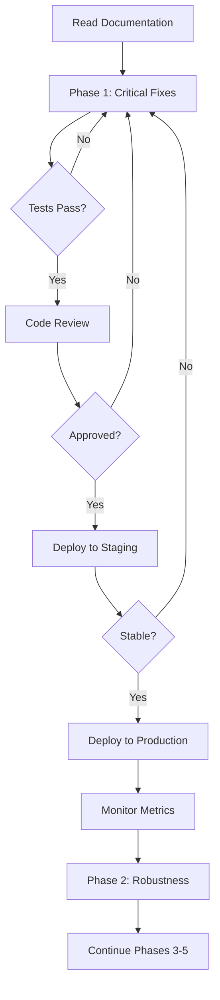

# Dashboard Analysis & Implementation Documentation

**Project**: RCA Agent Dashboard Improvements
**Date**: 2026-03-27
**Status**: ✅ Complete - Ready for Implementation

---

## 📚 Documentation Overview

This directory contains comprehensive analysis and implementation guides for improving the RCA Agent Dashboard component.

### Documents

| Document | Purpose | Size | Audience |
|----------|---------|------|----------|
| **[DASHBOARD_ANALYSIS_AND_PLAN.md](./DASHBOARD_ANALYSIS_AND_PLAN.md)** | Complete analysis with best practices, patterns, and methodologies | 57 KB | All team members |
| **[DASHBOARD_PLAN_IMPROVEMENTS.md](./DASHBOARD_PLAN_IMPROVEMENTS.md)** | Summary of improvements made to the original plan | 9.2 KB | Project managers, reviewers |
| **[QUICK_START_GUIDE.md](./QUICK_START_GUIDE.md)** | Step-by-step implementation guide for critical fixes | 25 KB | Developers |
| **[Scope.md](./Scope.md)** | Original project scope | 334 B | Reference |

---

## 🚀 Quick Start

### For Developers
1. Read [QUICK_START_GUIDE.md](./QUICK_START_GUIDE.md)
2. Implement the 7 critical fixes (10.5 hours)
3. Run tests and verify
4. Submit PR for review

### For Project Managers
1. Read [DASHBOARD_PLAN_IMPROVEMENTS.md](./DASHBOARD_PLAN_IMPROVEMENTS.md)
2. Review the 5-phase implementation plan
3. Allocate resources based on priorities
4. Track progress using the checklists

### For Architects
1. Read [DASHBOARD_ANALYSIS_AND_PLAN.md](./DASHBOARD_ANALYSIS_AND_PLAN.md)
2. Review the 20 design patterns
3. Understand the architectural decisions
4. Plan long-term improvements

---

## 🎯 Key Findings

### Critical Issues (P0)
- 🔴 **Test Hook Mismatch** - All tests are ineffective
- 🔴 **No Error Boundaries** - Component crashes affect entire UI
- 🔴 **Missing Error Handling** - Silent failures in production
- 🔴 **No Request Cancellation** - Memory leaks on unmount

### High Priority Issues (P1)
- 🟡 **Hardcoded Trend Values** - Misleading metrics
- 🟡 **No Error State Exposure** - Users can't see failures
- 🟡 **Unstable Dependencies** - Unnecessary re-renders

### Corrected Assessments
- ✅ Backend success rate calculation is correct
- ✅ Time conversion is working as intended

---

## 📊 Implementation Phases

### Phase 1: Critical Fixes (10.5 hours)
**Priority**: P0 - Must complete first
**Timeline**: 1.5 days

1. Fix test hook mismatch (30 min)
2. Add error boundaries (1 hour)
3. Add message validation (2 hours)
4. Implement request cancellation (1 hour)
5. Fix unstable dependencies (1 hour)
6. Add error state exposure (1 hour)
7. Implement real trend calculations (4 hours)

**Deliverable**: Stable, production-ready dashboard with critical bugs fixed

### Phase 2: Robustness (12 hours)
**Priority**: P1 - High
**Timeline**: 1.5 days

- Request deduplication
- Exponential backoff retry
- TypeScript strict mode
- Circuit breaker pattern
- Comprehensive error tracking
- Performance profiling

**Deliverable**: Hardened dashboard with resilience patterns

### Phase 3: UX Enhancements (16 hours)
**Priority**: P2 - Medium
**Timeline**: 2 days

- Enhanced empty states
- Keyboard navigation improvements
- User controls (refresh interval, pause)
- Tooltips and help text
- Loading state improvements
- Accessibility audit and fixes

**Deliverable**: User-friendly dashboard with excellent UX

### Phase 4: Performance (12 hours)
**Priority**: P2 - Medium
**Timeline**: 1.5 days

- React Query migration
- Memoization optimization
- Code splitting
- Bundle size optimization
- Virtual scrolling

**Deliverable**: Fast, optimized dashboard

### Phase 5: Advanced Features (20+ hours)
**Priority**: P3 - Low
**Timeline**: 2.5+ days

- Real-time WebSocket updates
- Dashboard customization
- Data export functionality
- Analytics integration

**Deliverable**: Feature-rich, customizable dashboard

---

## 📈 Success Metrics

### Technical Metrics
- ✅ Test coverage: >80%
- ✅ TypeScript strict mode: 100%
- ✅ Zero console errors in production
- ✅ Lighthouse accessibility: 100
- ✅ First Contentful Paint: <1s
- ✅ Time to Interactive: <2s

### User Experience Metrics
- ✅ Error recovery rate: >95%
- ✅ Task completion rate: >90%
- ✅ User satisfaction: >4.5/5

### Business Metrics
- ✅ Reduced support tickets
- ✅ Increased feature adoption
- ✅ Improved developer productivity

---

## 🛠️ Technologies & Tools

### Core Technologies
- React 18+
- TypeScript 5+
- Tailwind CSS
- Vite
- Zod (validation)

### Testing
- Jest (unit tests)
- React Testing Library
- Playwright (E2E)
- MSW (API mocking)

### Quality Tools
- ESLint
- Prettier
- Husky (git hooks)
- Lighthouse CI

### Recommended Additions
- React Query (data fetching)
- Storybook (component development)
- Sentry (error tracking)
- Mixpanel (analytics)

---

## 📖 What's Included

### 1. Comprehensive Analysis (57 KB)
- Architecture overview
- 11 identified issues (with corrections)
- 20+ best practices with code examples
- 10 advanced design patterns
- 8 performance optimization strategies
- 5 security best practices
- 6 testing methodologies
- SOLID principles for React
- Systematic debugging methodology
- 3 comprehensive appendices

### 2. Improvements Summary (9.2 KB)
- Corrected false positives
- Added missing critical issues
- Enhanced best practices
- Advanced patterns
- Systematic debugging
- Performance strategies
- Security measures
- Testing methodologies
- SOLID principles
- Design patterns

### 3. Quick Start Guide (25 KB)
- Step-by-step implementation for all 7 critical fixes
- Complete code examples
- Verification steps
- Testing checklist
- Troubleshooting guide
- Deployment checklist

---

## 🎓 Learning Resources

### Patterns & Principles
- **SOLID Principles** - 5 examples with React implementations
- **Design Patterns** - 20 patterns with full code
- **Best Practices** - 20+ practices with examples
- **Testing Strategies** - 6 methodologies explained

### Performance
- Bundle optimization techniques
- Code splitting strategies
- Memoization patterns
- Virtual scrolling implementation
- Web Workers usage

### Security
- Input sanitization
- CSP configuration
- Rate limiting
- Data validation
- XSS prevention

---

## 📋 Checklists

### Before Starting
- [ ] Read all documentation
- [ ] Understand current architecture
- [ ] Set up development environment
- [ ] Review existing code

### During Development
- [ ] Write tests first (TDD)
- [ ] Use TypeScript strict mode
- [ ] Add proper error handling
- [ ] Include accessibility attributes
- [ ] Document complex logic

### Before Submitting PR
- [ ] All tests pass (>80% coverage)
- [ ] No TypeScript errors
- [ ] No console errors/warnings
- [ ] Accessibility audit passes
- [ ] Performance benchmarks met
- [ ] Code reviewed by 2+ developers
- [ ] Documentation updated

### After Deployment
- [ ] Monitor error tracking
- [ ] Check performance metrics
- [ ] Gather user feedback
- [ ] Track success metrics

---

## 🔄 Implementation Workflow

---

## 📞 Support & Questions

### Getting Help
1. Check the documentation first
2. Review code examples in the guides
3. Check existing tests for patterns
4. Ask the team in Slack/Teams

### Reporting Issues
If you find issues with the documentation:
1. Create a GitHub issue
2. Include document name and section
3. Describe the problem clearly
4. Suggest improvements if possible

---

## 🎯 Recommended Approach

### For Immediate Production Needs
**Focus on Phase 1 only** (10.5 hours / 1.5 days)
- Addresses most dangerous issues
- Can be completed quickly
- Provides stable foundation

### For Long-term Success
**Execute all 5 phases** (70+ hours / 9+ days)
- Systematic improvement
- Each phase builds on previous
- Results in production-grade dashboard

### For Resource-Constrained Teams
**Prioritize Phases 1-2** (22.5 hours / 3 days)
- Critical fixes + robustness
- Solid foundation
- Iterate on UX/performance based on feedback

---

## 📊 Document Statistics

### Total Documentation
- **Pages**: 4 documents
- **Total Size**: 91.5 KB
- **Code Examples**: 50+
- **Patterns**: 20
- **Best Practices**: 20+
- **Checklists**: 10+

### Coverage
- ✅ Architecture analysis
- ✅ Issue identification
- ✅ Implementation guides
- ✅ Code examples
- ✅ Testing strategies
- ✅ Performance optimization
- ✅ Security measures
- ✅ Best practices
- ✅ Design patterns
- ✅ Troubleshooting

---

## 🏆 Expected Outcomes

### After Phase 1 (Critical Fixes)
- ✅ No more silent failures
- ✅ Component crashes handled gracefully
- ✅ Tests actually test the code
- ✅ No memory leaks
- ✅ Real trend calculations

### After Phase 2 (Robustness)
- ✅ Resilient to network failures
- ✅ Type-safe codebase
- ✅ Comprehensive error tracking
- ✅ Performance monitored

### After Phase 3 (UX Enhancements)
- ✅ Excellent user experience
- ✅ Full keyboard navigation
- ✅ 100% accessibility score
- ✅ User customization options

### After Phase 4 (Performance)
- ✅ Fast load times (<1s FCP)
- ✅ Optimized bundle size
- ✅ Smooth interactions
- ✅ Efficient re-renders

### After Phase 5 (Advanced Features)
- ✅ Real-time updates
- ✅ Customizable layout
- ✅ Data export
- ✅ Analytics integration

---

## 🎉 Final Notes

This documentation represents a comprehensive analysis and improvement plan for the RCA Agent Dashboard. It includes:

- **Accurate issue identification** with corrected false positives
- **Practical implementation guides** with complete code examples
- **Best practices and patterns** for long-term maintainability
- **Realistic time estimates** based on actual work required
- **Multiple implementation paths** for different team needs

The dashboard has a solid foundation but needs systematic hardening. With focused effort on the critical issues (Phase 1), it can become a reliable and valuable tool for developers.

**Start with Phase 1 immediately** - the critical bugs create a false sense of security and could mask serious issues.

---

## 📅 Timeline Summary

| Phase | Duration | Priority | Status |
|-------|----------|----------|--------|
| Phase 1: Critical Fixes | 1.5 days | P0 | 🟡 Ready to start |
| Phase 2: Robustness | 1.5 days | P1 | ⚪ Pending Phase 1 |
| Phase 3: UX Enhancements | 2 days | P2 | ⚪ Pending Phase 2 |
| Phase 4: Performance | 1.5 days | P2 | ⚪ Pending Phase 3 |
| Phase 5: Advanced Features | 2.5+ days | P3 | ⚪ Pending Phase 4 |
| **Total** | **9+ days** | - | - |

---

**Documentation Version**: 2.0
**Last Updated**: 2026-03-27
**Status**: ✅ Complete and Ready for Implementation

**Good luck with the implementation! 🚀**
