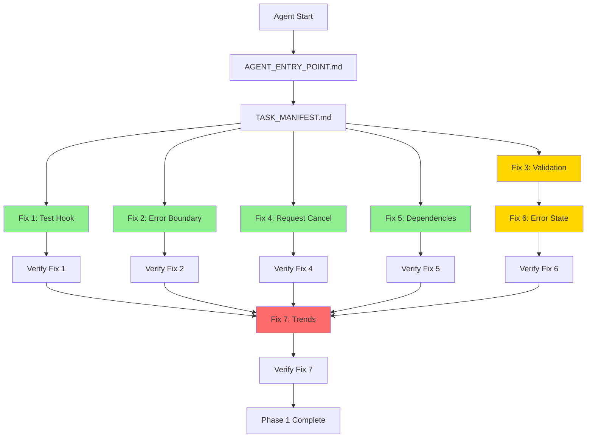

# Dashboard Documentation Restructure - Design Spec

**Date**: 2026-03-27
**Status**: Design Phase
**Purpose**: Optimize documentation for agent/subagent workforce execution

---

## Problem Statement

Current documentation structure (4 files, 17K tokens, 13K words) is too large and poorly organized for efficient agent workflows:

- **Context bloat**: Consumes 17% of 100K context window
- **Information overload**: 50+ code examples, 20 patterns scattered across files
- **Redundancy**: Same information repeated in multiple files
- **Poor scannability**: No clear entry points for specific tasks
- **Mixed concerns**: Strategic planning mixed with tactical implementation

This creates inefficiency when agents need to:
1. Quickly find specific task instructions
2. Work on parallel tasks without loading irrelevant context
3. Verify dependencies between tasks
4. Reference code examples without reading entire documents

---

## Goals

### Primary Goals
1. **Reduce context consumption**: From 17K to <3K tokens for typical agent tasks
2. **Enable parallel execution**: Isolate independent tasks into separate files
3. **Improve navigation**: Clear entry points and task manifest
4. **Preserve all content**: Archive original docs, don't lose information
5. **Agent-optimized**: Structure specifically for AI agent consumption

### Success Criteria
- Agent can start work with <1K token context load
- Individual task files are <500 words each
- Dependency graph is explicit and visual
- Zero information loss from original docs
- New structure tested with actual agent workflow

---

## Architecture

### Information Hierarchy

```
Level 1: Entry Point (500 words)
  ├─ Agent role and mission
  ├─ Quick context (what/why)
  └─ Navigation to other docs

Level 2: Task Manifest (800 words)
  ├─ Phase 1 tasks with dependencies
  ├─ File locations quick reference
  └─ Verification commands

Level 3: Task Files (300 words each)
  ├─ Problem statement
  ├─ Solution with code
  ├─ Files to modify
  └─ Verification steps

Level 4: Reference (lookup only)
  ├─ Architecture overview
  ├─ Patterns and practices
  └─ Testing strategies

Level 5: Archive (original docs)
```

### Directory Structure

```
docs/FInal_PP/
├── AGENT_ENTRY_POINT.md          # 500 words - START HERE
├── TASK_MANIFEST.md              # 800 words - Task list with dependencies
├── fixes/                        # Isolated task files
│   ├── fix-1-test-hook.md
│   ├── fix-2-error-boundary.md
│   ├── fix-3-message-validation.md
│   ├── fix-4-request-cancellation.md
│   ├── fix-5-unstable-dependencies.md
│   ├── fix-6-error-state-exposure.md
│   └── fix-7-real-trends.md
├── reference/                    # Lookup only - not loaded by default
│   ├── architecture-overview.md
│   ├── patterns-and-practices.md
│   ├── testing-strategies.md
│   └── troubleshooting.md
├── context/                      # Background info
│   ├── original-analysis.md      # Symlink or summary
│   ├── improvements-summary.md
│   └── project-scope.md
└── archive/                      # Original docs preserved
    ├── DASHBOARD_ANALYSIS_AND_PLAN.md
    ├── DASHBOARD_PLAN_IMPROVEMENTS.md
    ├── QUICK_START_GUIDE.md
    └── README.md
```

---

## Component Design

### 1. AGENT_ENTRY_POINT.md

**Purpose**: Single starting point for any agent session

**Content** (500 words max):
- Agent identity and role
- Mission statement (fix 7 critical bugs)
- Quick context (2-3 sentences on what/why)
- Navigation map to other docs
- Success criteria
- Estimated time: 10.5 hours

**Key principle**: Agent should understand their mission in <60 seconds of reading

### 2. TASK_MANIFEST.md

**Purpose**: Complete task list with dependencies and quick reference

**Content** (800 words max):
- Phase 1: 7 critical fixes
  - Each fix: 1-2 sentence description
  - Dependency graph (visual)
  - Estimated time per fix
- File locations quick reference table
- Verification commands
- Links to individual fix files

**Key principle**: Agent can plan execution strategy without reading implementation details

### 3. Individual Fix Files (fixes/*.md)

**Purpose**: Complete, isolated instructions for one specific fix

**Content** (300 words max per file):
- **Problem**: 2-3 sentences explaining the bug
- **Solution**: Code snippet (copy-paste ready)
- **Files to modify**: Exact paths
- **Verification**: Command to run
- **Dependencies**: What must complete first (if any)
- **Estimated time**: Hours/minutes

**Key principle**: Agent can complete the fix with only this file loaded

**Template structure**:
```markdown
# Fix N: [Title]

**Priority**: P0/P1
**Time**: X hours
**Dependencies**: [None | Fix N must complete first]

## Problem
[2-3 sentences]

## Solution
[Code snippet]

## Files to Modify
- path/to/file.ts (lines X-Y)

## Verification
```bash
npm test -- specific.test.tsx
```

## Success Criteria
- [ ] Tests pass
- [ ] No TypeScript errors
- [ ] Specific behavior verified
```

### 4. Reference Files (reference/*.md)

**Purpose**: Deep-dive information loaded only when needed

**Content**:
- **architecture-overview.md** (1000 words): Component relationships, data flow
- **patterns-and-practices.md** (2000 words): Best practices from original docs
- **testing-strategies.md** (1500 words): Testing methodologies
- **troubleshooting.md** (800 words): Common issues and solutions

**Key principle**: Not loaded by default, only when agent needs deep context

### 5. Context Files (context/*.md)

**Purpose**: Links to background information

**Content**:
- Summaries or symlinks to original comprehensive docs
- Project scope
- Historical context

**Key principle**: Available but not required for task execution

---

## Data Flow

### Agent Workflow

```
1. Agent starts session
   └─> Reads AGENT_ENTRY_POINT.md (500 words, ~650 tokens)

2. Agent plans work
   └─> Reads TASK_MANIFEST.md (800 words, ~1040 tokens)
   └─> Identifies parallel vs sequential tasks

3. Agent executes Fix 1
   └─> Reads fixes/fix-1-test-hook.md (300 words, ~390 tokens)
   └─> Completes fix
   └─> Verifies

4. Agent executes Fix 2 (parallel with Fix 1)
   └─> Reads fixes/fix-2-error-boundary.md (300 words, ~390 tokens)
   └─> Completes fix
   └─> Verifies

5. Agent encounters issue
   └─> Reads reference/troubleshooting.md (only if needed)

Total context for typical task: ~2K tokens (vs 17K in old structure)
```

### Dependency Graph



**Parallel execution groups**:
- **Group A** (independent): Fix 1, Fix 2, Fix 4, Fix 5
- **Group B** (sequential): Fix 3 → Fix 6
- **Group C** (depends on all): Fix 7

---

## Content Migration Strategy

### From QUICK_START_GUIDE.md

**Extract to individual fix files**:
- Lines 27-82 → fix-1-test-hook.md
- Lines 84-208 → fix-2-error-boundary.md
- Lines 210-410 → fix-3-message-validation.md
- Lines 412-524 → fix-4-request-cancellation.md
- Lines 526-637 → fix-5-unstable-dependencies.md
- Lines 639-645 → fix-6-error-state-exposure.md (note: references Fix 3)
- Lines 647-883 → fix-7-real-trends.md

**Extract to reference files**:
- Testing checklist → reference/testing-strategies.md
- Troubleshooting section → reference/troubleshooting.md

### From DASHBOARD_ANALYSIS_AND_PLAN.md

**Extract to reference files**:
- Architecture section → reference/architecture-overview.md
- Best practices → reference/patterns-and-practices.md
- Design patterns → reference/patterns-and-practices.md
- Testing methodologies → reference/testing-strategies.md

**Keep in archive**:
- Full original document for comprehensive reference

### From DASHBOARD_PLAN_IMPROVEMENTS.md

**Extract to context**:
- Summary of improvements → context/improvements-summary.md
- Version history → context/improvements-summary.md

**Keep in archive**:
- Full original document

### From README.md

**Extract to AGENT_ENTRY_POINT.md**:
- Quick start section
- Success metrics
- Recommended approach

**Extract to TASK_MANIFEST.md**:
- Implementation phases
- Timeline summary

**Keep in archive**:
- Full original document

---

## Agent Configuration

### Specialized Dashboard Agent Definition

```yaml
agent:
  name: "Dashboard Improvement Agent"
  version: "1.0.0"
  specialization: "React Dashboard Bug Fixes"

  capabilities:
    - React hooks debugging
    - TypeScript strict mode
    - Zod validation
    - Error boundary implementation
    - Performance optimization

  entry_point: "docs/FInal_PP/AGENT_ENTRY_POINT.md"

  task_manifest: "docs/FInal_PP/TASK_MANIFEST.md"

  context_budget:
    initial_load: 1300  # Entry + Manifest
    per_task: 400       # Individual fix file
    reference: 5000     # If needed

  execution_strategy: "mixed"  # Can spawn subagents for parallel work

  verification_required: true  # Must verify each fix

  success_criteria:
    - All 7 fixes completed
    - All tests passing
    - No TypeScript errors
    - No console warnings
```

### Agent Initialization Prompt

```markdown
You are the Dashboard Improvement Agent, a specialized AI agent focused on fixing critical bugs in the RCA Agent Dashboard component.

## Your Mission
Fix 7 critical bugs in Phase 1 (estimated 10.5 hours):
1. Test hook mismatch
2. Missing error boundaries
3. No message validation
4. No request cancellation
5. Unstable dependencies
6. No error state exposure
7. Hardcoded trend values

## Getting Started
1. Read: docs/FInal_PP/AGENT_ENTRY_POINT.md
2. Plan: docs/FInal_PP/TASK_MANIFEST.md
3. Execute: docs/FInal_PP/fixes/fix-*.md (in dependency order)

## Capabilities
- React hooks & TypeScript expertise
- Can spawn subagents for parallel work
- Must verify each fix before proceeding
- Access to reference docs when needed

## Context Budget
- Keep initial context under 2K tokens
- Load only relevant fix files
- Reference docs available on-demand

## Success Criteria
- All tests pass (>80% coverage)
- Zero TypeScript errors
- No console warnings
- Each fix verified independently

Begin by reading AGENT_ENTRY_POINT.md.
```

---

## Implementation Plan

### Phase 1: Setup (30 minutes)
1. Create directory structure
2. Create archive/ and move original docs
3. Create empty template files

### Phase 2: Core Files (2 hours)
1. Write AGENT_ENTRY_POINT.md
2. Write TASK_MANIFEST.md
3. Create dependency graph visual

### Phase 3: Task Files (3 hours)
1. Extract and write fix-1-test-hook.md
2. Extract and write fix-2-error-boundary.md
3. Extract and write fix-3-message-validation.md
4. Extract and write fix-4-request-cancellation.md
5. Extract and write fix-5-unstable-dependencies.md
6. Extract and write fix-6-error-state-exposure.md
7. Extract and write fix-7-real-trends.md

### Phase 4: Reference Files (2 hours)
1. Write architecture-overview.md
2. Write patterns-and-practices.md
3. Write testing-strategies.md
4. Write troubleshooting.md

### Phase 5: Context Files (30 minutes)
1. Write context summaries
2. Create symlinks or references

### Phase 6: Verification (1 hour)
1. Test agent workflow with actual agent
2. Measure token consumption
3. Verify all information preserved
4. Adjust as needed

**Total estimated time**: 9 hours

---

## Testing Strategy

### Verification Checklist

**Structure verification**:
- [ ] All directories created
- [ ] All files in correct locations
- [ ] Original docs preserved in archive/
- [ ] No broken links

**Content verification**:
- [ ] AGENT_ENTRY_POINT.md is <500 words
- [ ] TASK_MANIFEST.md is <800 words
- [ ] Each fix file is <300 words
- [ ] All code examples preserved
- [ ] Dependency graph is accurate

**Agent workflow verification**:
- [ ] Agent can start with <1K token load
- [ ] Agent can find specific fix quickly
- [ ] Agent can identify parallel tasks
- [ ] Agent can access reference when needed
- [ ] Total context for typical task <3K tokens

**Information preservation**:
- [ ] All 7 fixes documented
- [ ] All code examples present
- [ ] All verification steps included
- [ ] All troubleshooting preserved
- [ ] All patterns and practices accessible

### Test Scenarios

**Scenario 1: Agent starts fresh**
- Load AGENT_ENTRY_POINT.md
- Verify agent understands mission
- Measure token consumption (<650 tokens)

**Scenario 2: Agent plans work**
- Load TASK_MANIFEST.md
- Verify agent identifies parallel tasks
- Measure token consumption (<1040 tokens)

**Scenario 3: Agent executes Fix 1**
- Load fix-1-test-hook.md only
- Verify agent has all needed information
- Measure token consumption (<390 tokens)

**Scenario 4: Agent needs help**
- Load reference/troubleshooting.md
- Verify information is helpful
- Measure token consumption

**Scenario 5: Parallel execution**
- Load fix-1 and fix-2 simultaneously
- Verify no conflicts
- Measure total token consumption (<780 tokens)

---

## Risk Mitigation

### Risk 1: Information Loss
**Mitigation**:
- Keep all original docs in archive/
- Cross-reference during migration
- Verification checklist for content

### Risk 2: Broken Dependencies
**Mitigation**:
- Explicit dependency graph
- Test with actual agent workflow
- Clear documentation in each fix file

### Risk 3: Context Still Too Large
**Mitigation**:
- Measure token consumption at each step
- Further split files if needed
- Use summaries instead of full content

### Risk 4: Agent Confusion
**Mitigation**:
- Clear navigation in entry point
- Consistent file naming
- Test with actual agent before rollout

### Risk 5: Maintenance Burden
**Mitigation**:
- Document update process
- Keep archive as source of truth
- Automated checks for consistency

---

## Success Metrics

### Quantitative Metrics
- **Context reduction**: From 17K to <3K tokens (82% reduction target)
- **File count**: From 4 monolithic to 15+ focused files
- **Average file size**: <500 words per file
- **Agent startup time**: <1K tokens to understand mission
- **Task isolation**: Each fix file <400 tokens

### Qualitative Metrics
- Agent can start work without confusion
- Agent can identify parallel tasks
- Agent can complete fix with single file
- Agent can find help when needed
- No information loss from original docs

### Acceptance Criteria
- [ ] All quantitative metrics met
- [ ] Agent workflow tested successfully
- [ ] All original content preserved
- [ ] Team review approved
- [ ] Documentation updated

---

## Future Enhancements

### Phase 2-5 Documentation
- Apply same structure to remaining phases
- Create phase-specific entry points
- Maintain consistency

### Agent Improvements
- Add progress tracking
- Add automated verification
- Add error recovery procedures

### Documentation Maintenance
- Automated consistency checks
- Version control for specs
- Update procedures documented

---

## Appendix

### File Size Targets

| File Type | Target Size | Max Size | Rationale |
|-----------|-------------|----------|-----------|
| Entry Point | 500 words | 600 words | Quick orientation |
| Task Manifest | 800 words | 1000 words | Complete task list |
| Fix File | 300 words | 400 words | Single task focus |
| Reference | 1500 words | 2500 words | Deep dive when needed |
| Context | 500 words | 800 words | Background only |

### Token Estimation Formula

```
tokens ≈ words × 1.3
```

This accounts for:
- Markdown formatting
- Code blocks (higher token density)
- Special characters

### Directory Naming Conventions

- **Lowercase with hyphens**: `fix-1-test-hook.md`
- **Descriptive names**: `architecture-overview.md` not `arch.md`
- **Consistent prefixes**: All fixes start with `fix-N-`
- **No spaces**: Use hyphens for readability

---

## Conclusion

This restructure transforms 17K tokens of documentation into an agent-optimized structure where typical tasks consume <3K tokens. The design enables parallel execution, clear dependencies, and quick navigation while preserving all original content.

The specialized Dashboard Improvement Agent can now:
1. Start work with minimal context
2. Execute tasks independently
3. Spawn subagents for parallel work
4. Access deep reference when needed
5. Complete Phase 1 efficiently

**Next step**: Create implementation plan for building this structure.
