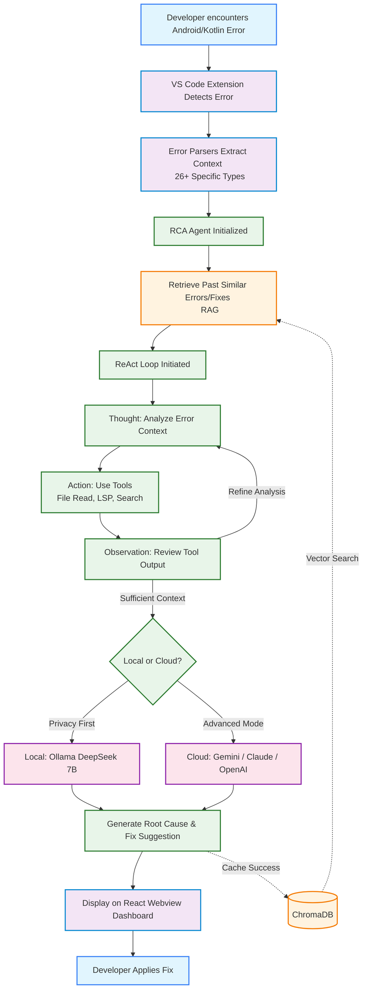

# RCA Agent: Technology Stack & Application Flow

## 1. Technology Stack

The RCA (Root Cause Analysis) Agent leverages a modern, local-first architecture integrated directly into the developer's IDE.

### Frontend (IDE Integration)
* **VS Code Extension API:** The core host environment for the agent.
* **React & TypeScript:** Used for the interactive Webview dashboard (Error Queue & Fix Suggestions).

### Backend & Agent Logic
* **Node.js / TypeScript:** Core extension logic, tool execution, and orchestration.
* **ReAct Agent Framework:** Custom implementation of the Synergizing Reasoning and Acting loop (Thought → Action → Observation).
* **Error Parsers:** 26+ custom parsers specifically designed for Kotlin/Android build and runtime errors.

### AI & Data Layer
* **Local LLM:** Ollama running `DeepSeek-R1-Distill-Qwen-7B` for privacy-preserving, local-first inference.
* **Cloud LLMs (Hybrid Mode):** Integrations with Gemini, Claude, and OpenAI via cloud APIs for fallback/advanced reasoning.
* **Vector Database:** ChromaDB for local Retrieval-Augmented Generation (RAG) to cache and retrieve prior successful error resolutions.

## 2. Application Flow / Methodology

The following diagram illustrates the lifecycle of an error from detection to resolution within the RCA Agent system.

